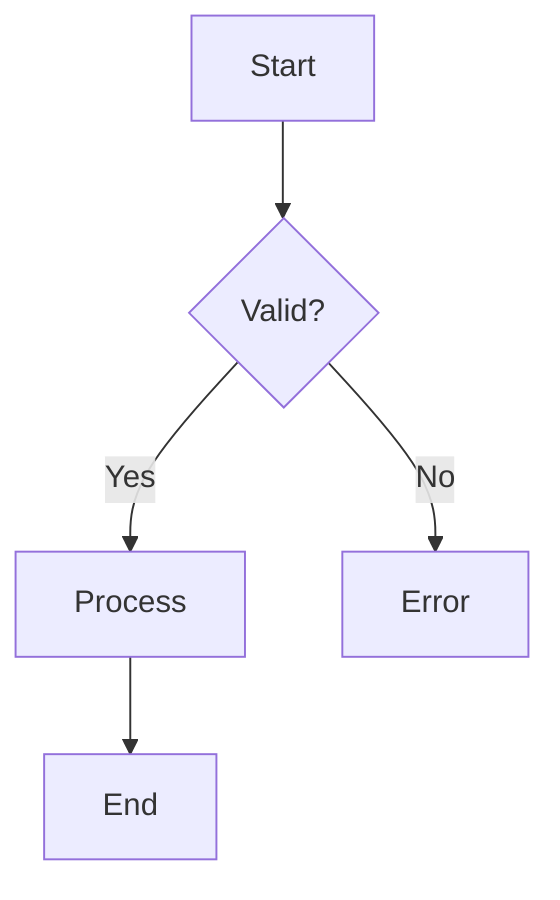
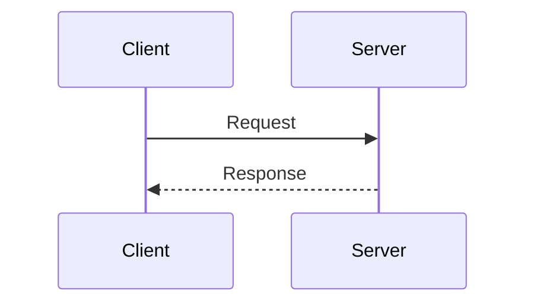
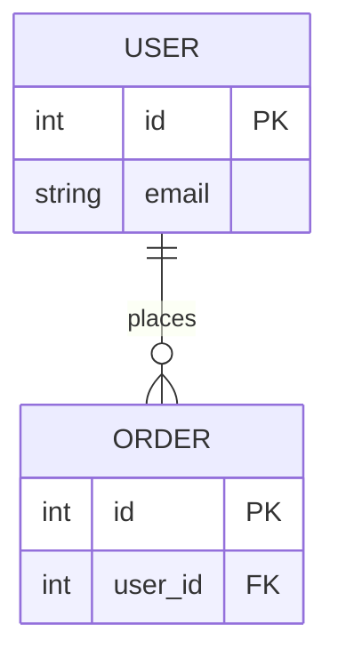
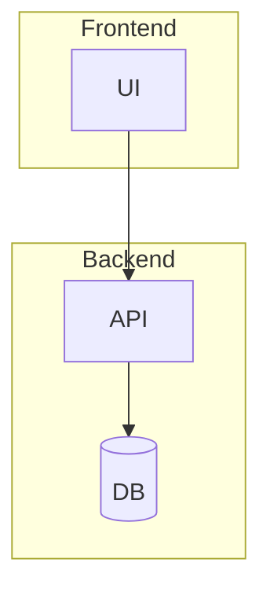
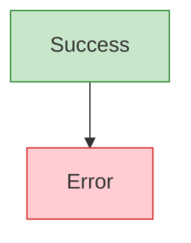

# Mermaid Builder

## Core Philosophy

- **Correctness**: Follow Mermaid syntax rules strictly
- **Clarity**: Diagrams communicate complex ideas simply
- **Simplicity**: Avoid overloading with unnecessary detail
- **Modularity**: Break complex diagrams into subgraphs

## Critical: Label Quoting Rule

**RULE: Wrap labels in double quotes if they contain spaces, special characters, or punctuation.**

```mermaid
%% CORRECT - labels with spaces quoted
flowchart LR
    A["User Login"] --> B["Process Request"]
    C["Pay $100?"] --> D["Confirm (Yes/No)"]

%% WRONG - will fail to render
flowchart LR
    A[User Login] --> B[Process Request]
```

**Must quote:** Spaces, special chars (`$%&`), punctuation (`:,;`), operators (`()[]`)
**Optional:** Simple alphanumeric (`Login`, `Process`, `Node1`)

**When in doubt, use quotes. It never hurts.**

## Quick Reference

### Flowchart Shapes

| Syntax | Shape |
|--------|-------|
| `["Text"]` | Rectangle |
| `("Text")` | Rounded |
| `{"Text"}` | Diamond (decision) |
| `[("Text")]` | Cylinder (database) |
| `(("Text"))` | Circle |

### Arrow Types

| Syntax | Type |
|--------|------|
| `-->` | Solid arrow |
| `---` | Solid line |
| `-.->` | Dotted arrow |
| `==>` | Thick arrow |
| `-->|Label|` | Arrow with label |

### Diagram Types

| Type | Declaration | Use Case |
|------|-------------|----------|
| Flowchart | `flowchart TD` | Processes, workflows, decisions |
| Sequence | `sequenceDiagram` | Component interactions, API flows |
| Class | `classDiagram` | OOP structure, models |
| State | `stateDiagram-v2` | State transitions |
| Gantt | `gantt` | Timelines, scheduling |
| ER | `erDiagram` | Database schema |
| Pie | `pie` | Proportional data |

**Directions:** `TB`/`TD` (top-down), `BT` (bottom-up), `LR` (left-right), `RL` (right-left)

See [resources/diagram-examples.md](resources/diagram-examples.md) for complete examples of each diagram type.

## Minimal Examples

### Flowchart



### Sequence



### ER Diagram



## Subgraphs for Organization



## Styling



## Common Errors to Avoid

| Error | Wrong | Correct |
|-------|-------|---------|
| Unquoted spaces | `A[User Login]` | `A["User Login"]` |
| Invalid arrow | `A -> B` | `A --> B` |
| Unquoted special | `A[Cost: $100]` | `A["Cost: $100"]` |
| Missing bracket | `A["Node --> B` | `A["Node"] --> B` |

## Validation Checklist

- [ ] Labels with spaces are quoted
- [ ] Labels with special characters quoted
- [ ] Brackets properly matched
- [ ] Arrow syntax correct (`-->` not `->`)
- [ ] Node IDs unique and meaningful
- [ ] Comments explain complex sections
- [ ] Previewed without errors

## Data Lineage Patterns

See [resources/data-lineage.md](resources/data-lineage.md) for:
- ETL pipeline patterns
- Multi-layer data architecture
- Cross-system data flows
- Database schema lineage
- Streaming data lineage
- Column-level lineage

## Resources

- [Mermaid Docs](https://mermaid.js.org/)
- [Live Editor](https://mermaid.live/)
- [Syntax Reference](https://mermaid.js.org/intro/syntax-reference.html)

---

**Remember: The quoting rule is the #1 cause of Mermaid rendering failures. When in doubt, quote it.**
