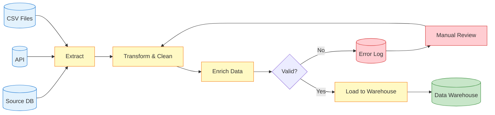
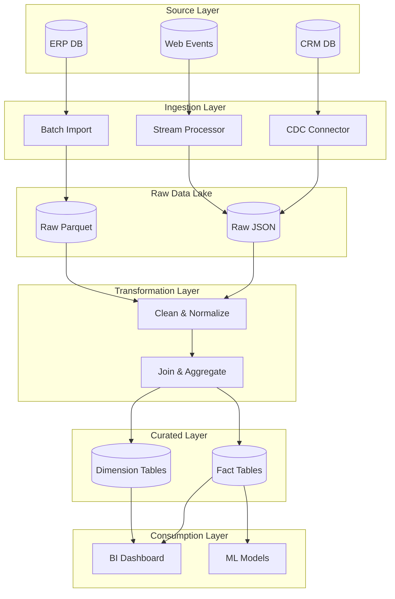
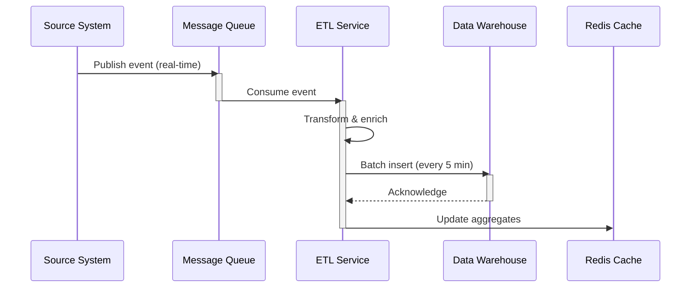
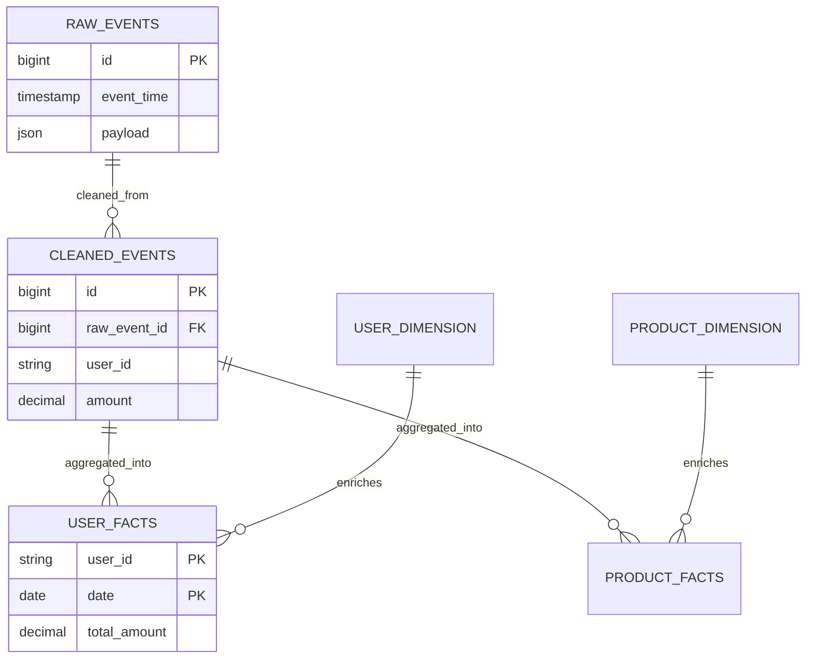
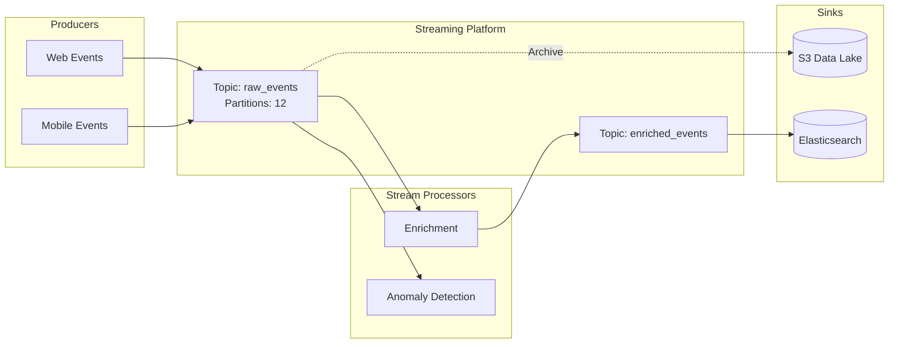
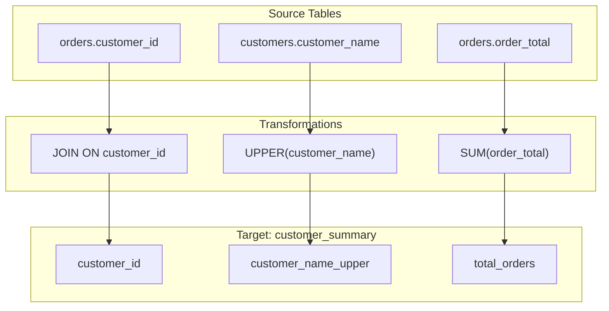

# Data Lineage Visualization Patterns

## Simple Data Pipeline Pattern

**Use for:** ETL processes, data transformations, single-direction flows

## Multi-Layer Data Architecture

## Cross-System Data Flow (Sequence)

## Database Schema Lineage (ER Diagram)

## Streaming Data Lineage (Kafka/Kinesis)

## Column-Level Lineage

## Best Practices

1. **Show directionality** - Data flows left-to-right or top-to-bottom
2. **Include metadata** - Record counts, refresh frequency, retention
3. **Highlight transformations** - Make it obvious where data changes
4. **Use consistent styling** - Sources, processes, targets have distinct colors
5. **Add quality checks** - Show validation points and error handling
6. **Document timing** - Batch intervals, streaming latency
7. **Keep focused** - Break complex pipelines into multiple diagrams
