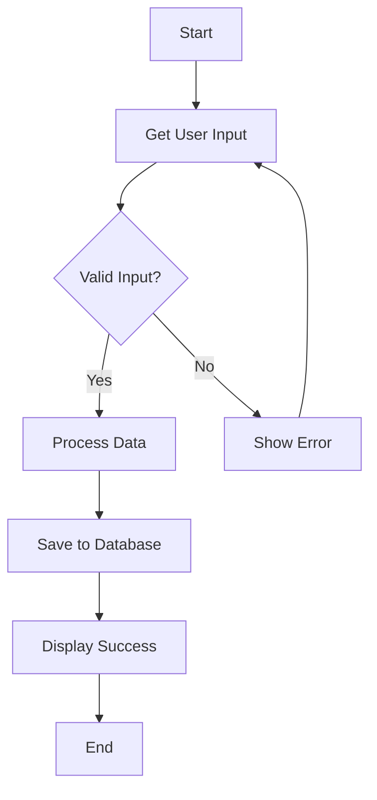
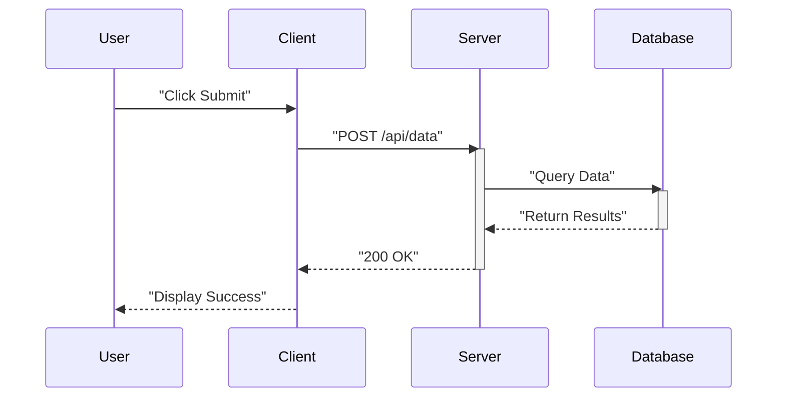
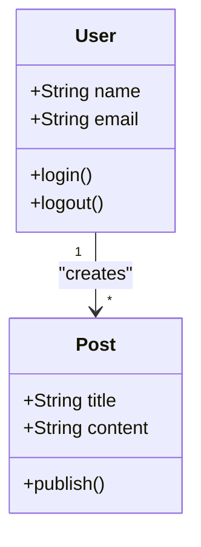
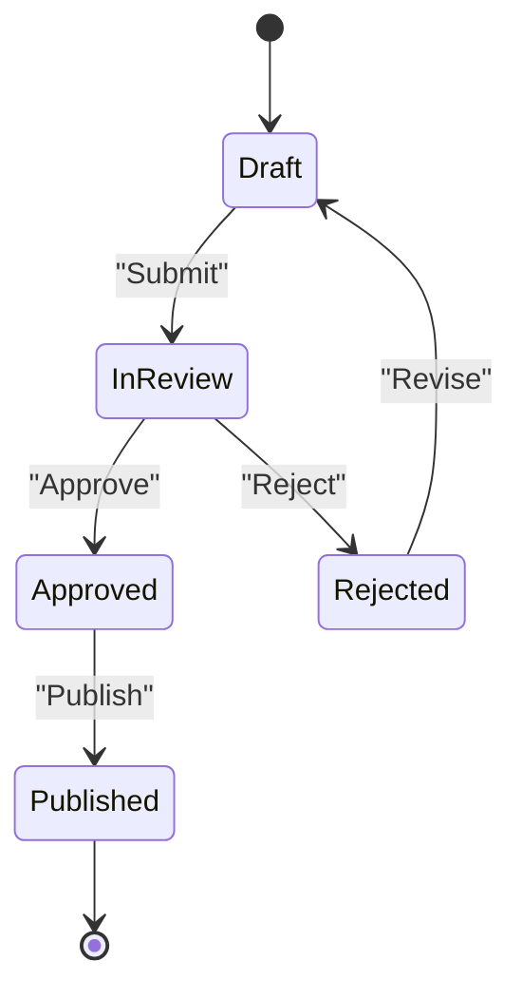
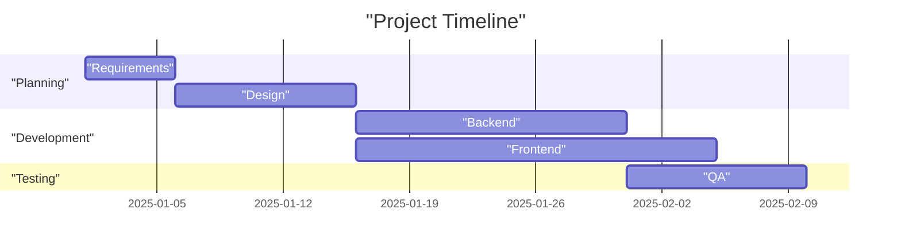
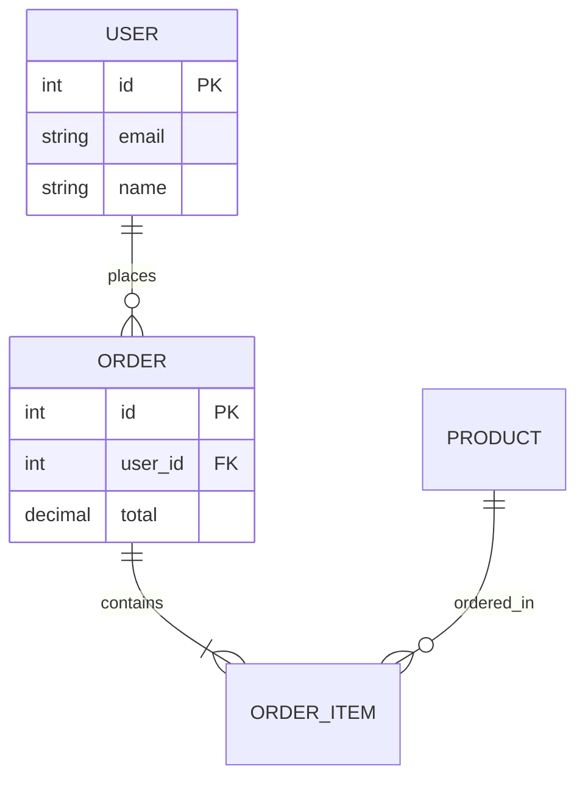
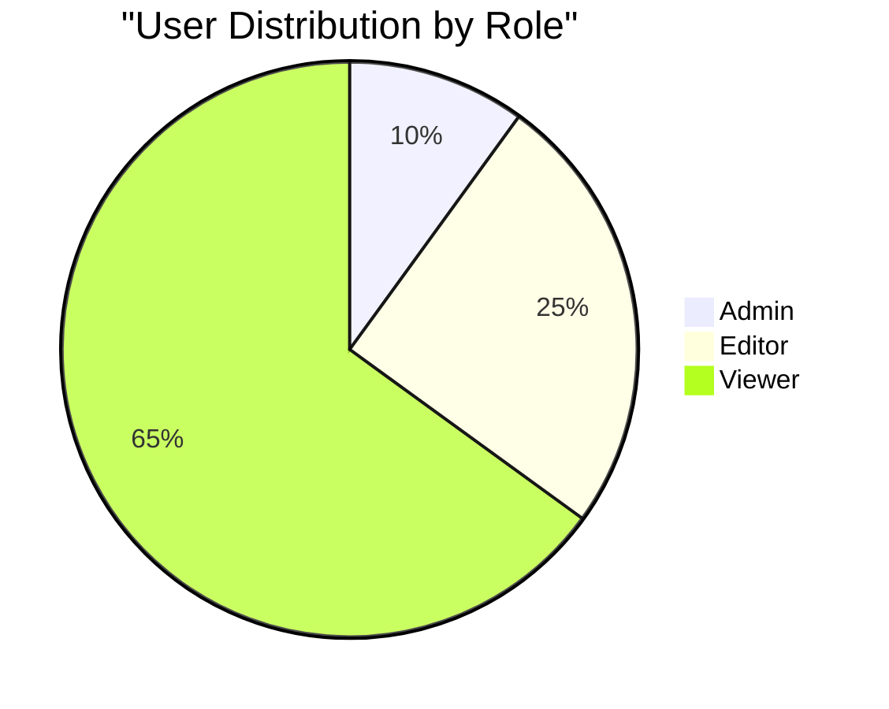
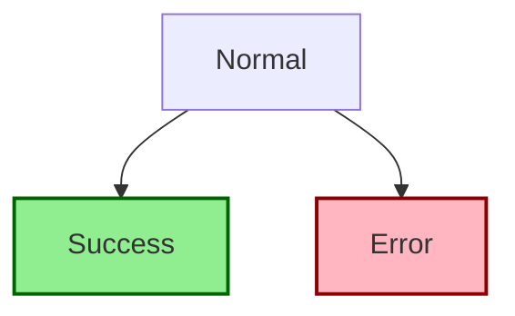
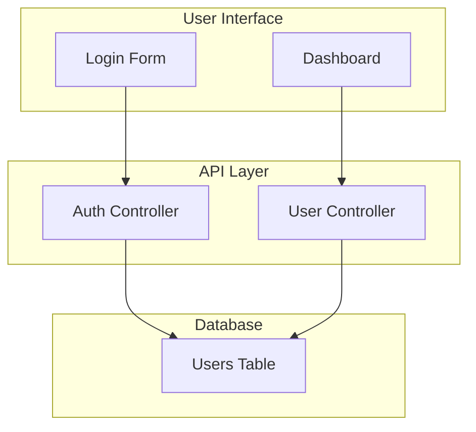

# Diagram Type Examples

## Flowchart

**Direction options:** `TB`/`TD` (top-down), `BT` (bottom-up), `LR` (left-right), `RL` (right-left)

## Sequence Diagram

**Key elements:** `participant`, `->>` (solid), `-->>` (response), `activate`/`deactivate`

## Class Diagram

**Relationships:** `<|--` (inheritance), `*--` (composition), `o--` (aggregation), `-->` (association)

## State Diagram

## Gantt Chart

## Entity-Relationship Diagram

**Cardinality:** `||--||` (one-to-one), `||--o{` (one-to-many), `}o--o{` (many-to-many)

## Pie Chart

## Styling with classDef

## Subgraphs for Organization

