# SwiftMTP 架构图与代码逻辑图

本文档包含 SwiftMTP 的完整架构图、代码逻辑图和时序图。

---

## 1. 整体架构图

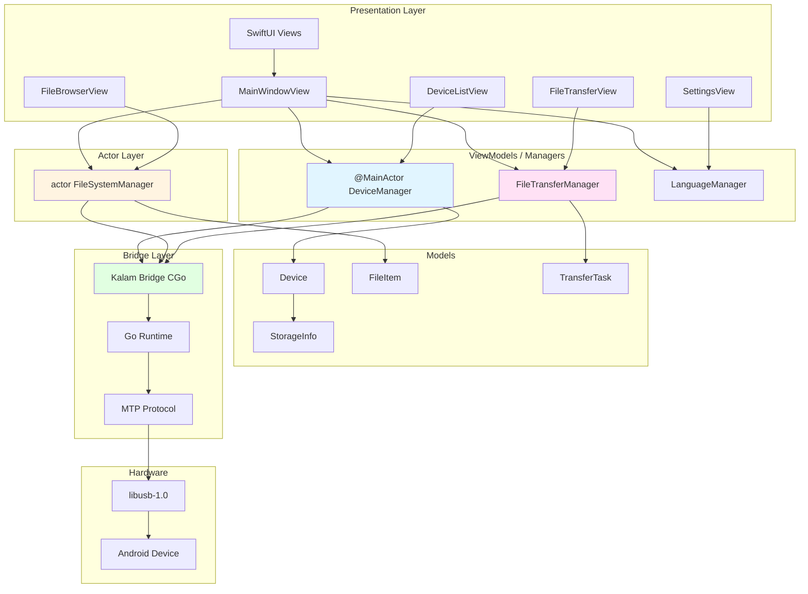
```mermaid
flowchart TB
    subgraph "Presentation Layer"
        SWIFTUI[SwiftUI Views]
        MAIN[MainWindowView]
        DEVICE[DeviceListView]
        FILE[FileBrowserView]
        TRANSFER[FileTransferView]
        SETTINGS[SettingsView]
    end

    subgraph "ViewModels / Managers"
        DM["@MainActor DeviceManager"]
        FTM["FileTransferManager"]
        LM["LanguageManager"]
    end

    subgraph "Actor Layer"
        FSM["actor FileSystemManager"]
    end

    subgraph "Models"
        DEVICE_MODEL["Device"]
        FILE_MODEL["FileItem"]
        TASK_MODEL["TransferTask"]
        STORAGE["StorageInfo"]
    end

    subgraph "Bridge Layer"
        BRIDGE["Kalam Bridge CGo"]
        GO["Go Runtime"]
        MTP["MTP Protocol"]
    end

    subgraph "Hardware"
        USB["libusb-1.0"]
        ANDROID["Android Device"]
    end

    SWIFTUI --> MAIN
    MAIN --> DM
    MAIN --> FTM
    MAIN --> FSM
    MAIN --> LM

    DEVICE --> DM
    FILE --> FSM
    TRANSFER --> FTM
    SETTINGS --> LM

    DM --> DEVICE_MODEL
    FSM --> FILE_MODEL
    FTM --> TASK_MODEL
    DEVICE_MODEL --> STORAGE

    DM --> BRIDGE
    FSM --> BRIDGE
    FTM --> BRIDGE

    BRIDGE --> GO
    GO --> MTP
    MTP --> USB
    USB --> ANDROID

    style DM fill:#e1f5ff
    style FSM fill:#fff4e1
    style FTM fill:#ffe1f5
    style BRIDGE fill:#e1ffe1
```

---

## 2. 类关系图

### 2.1 模型类关系

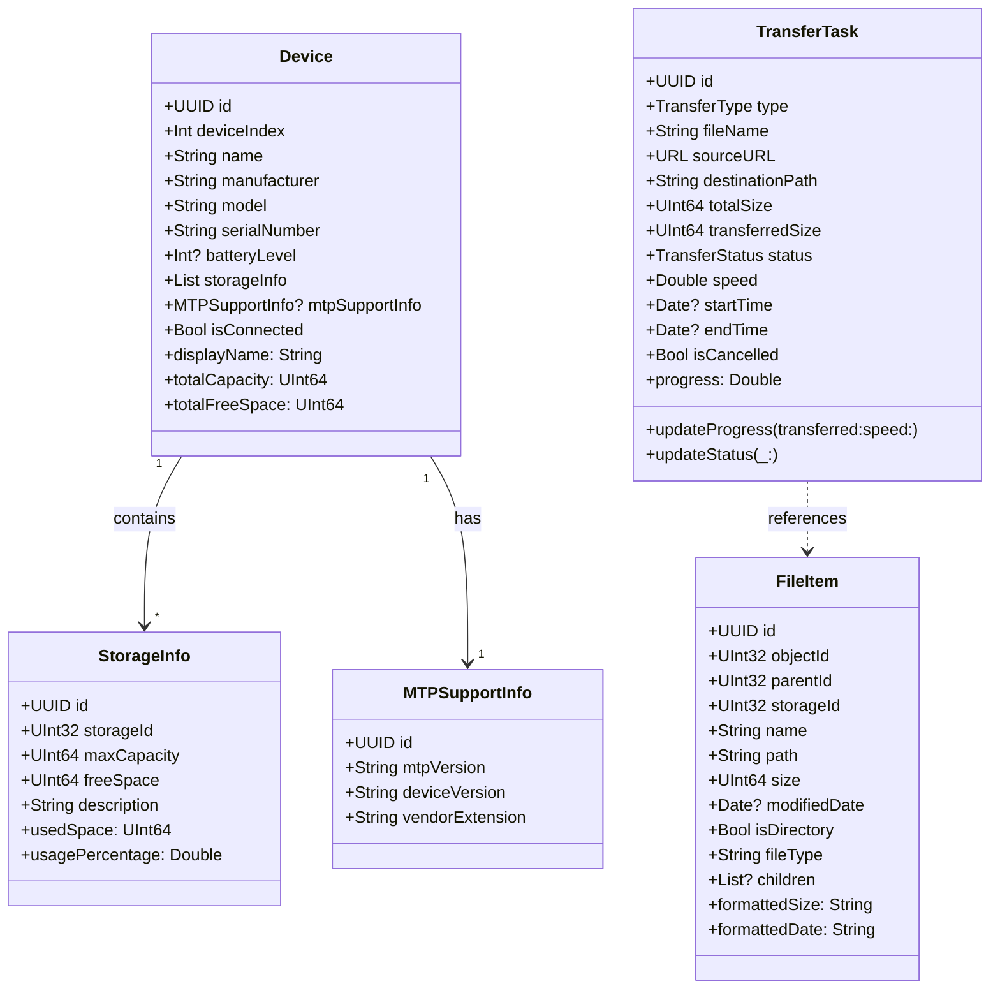
```mermaid
classDiagram
    class Device {
        +UUID id
        +Int deviceIndex
        +String name
        +String manufacturer
        +String model
        +String serialNumber
        +Int? batteryLevel
        +List storageInfo
        +MTPSupportInfo? mtpSupportInfo
        +Bool isConnected
        +displayName: String
        +totalCapacity: UInt64
        +totalFreeSpace: UInt64
    }

    class StorageInfo {
        +UUID id
        +UInt32 storageId
        +UInt64 maxCapacity
        +UInt64 freeSpace
        +String description
        +usedSpace: UInt64
        +usagePercentage: Double
    }

    class MTPSupportInfo {
        +UUID id
        +String mtpVersion
        +String deviceVersion
        +String vendorExtension
    }

    class FileItem {
        +UUID id
        +UInt32 objectId
        +UInt32 parentId
        +UInt32 storageId
        +String name
        +String path
        +UInt64 size
        +Date? modifiedDate
        +Bool isDirectory
        +String fileType
        +List? children
        +formattedSize: String
        +formattedDate: String
    }

    class TransferTask {
        +UUID id
        +TransferType type
        +String fileName
        +URL sourceURL
        +String destinationPath
        +UInt64 totalSize
        +UInt64 transferredSize
        +TransferStatus status
        +Double speed
        +Date? startTime
        +Date? endTime
        +Bool isCancelled
        +progress: Double
        +updateProgress(transferred:speed:)
        +updateStatus(_:)
    }

    Device "1" --> "*" StorageInfo : contains
    Device "1" --> "1" MTPSupportInfo : has
    TransferTask ..> FileItem : references
```

### 2.2 管理器类关系

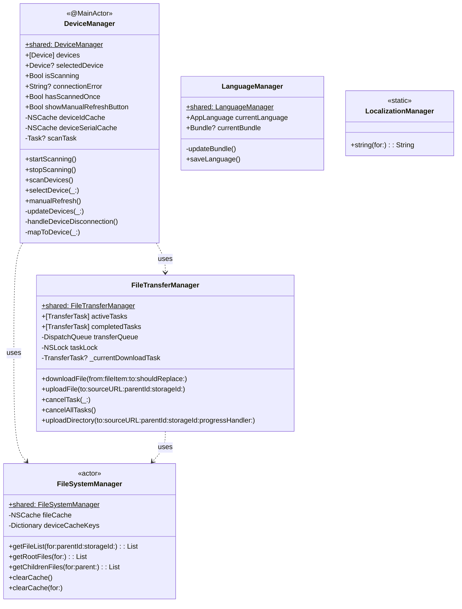
```mermaid
classDiagram
    class DeviceManager {
        <<@MainActor>>
        +shared: DeviceManager$
        +[Device] devices
        +Device? selectedDevice
        +Bool isScanning
        +String? connectionError
        +Bool hasScannedOnce
        +Bool showManualRefreshButton
        -NSCache deviceIdCache
        -NSCache deviceSerialCache
        -Task? scanTask
        +startScanning()
        +stopScanning()
        +scanDevices()
        +selectDevice(_:)
        +manualRefresh()
        -updateDevices(_:)
        -handleDeviceDisconnection()
        -mapToDevice(_:)
    }

    class FileSystemManager {
        <<actor>>
        +shared: FileSystemManager$
        -NSCache fileCache
        -Dictionary deviceCacheKeys
        +getFileList(for:parentId:storageId:): List
        +getRootFiles(for:): List
        +getChildrenFiles(for:parent:): List
        +clearCache()
        +clearCache(for:)
    }

    class FileTransferManager {
        +shared: FileTransferManager$
        +[TransferTask] activeTasks
        +[TransferTask] completedTasks
        -DispatchQueue transferQueue
        -NSLock taskLock
        -TransferTask? _currentDownloadTask
        +downloadFile(from:fileItem:to:shouldReplace:)
        +uploadFile(to:sourceURL:parentId:storageId:)
        +cancelTask(_:)
        +cancelAllTasks()
        +uploadDirectory(to:sourceURL:parentId:storageId:progressHandler:)
    }

    class LanguageManager {
        +shared: LanguageManager$
        +AppLanguage currentLanguage
        +Bundle? currentBundle
        -updateBundle()
        +saveLanguage()
    }

    class LocalizationManager {
        <<static>>
        +string(for:): String
    }

    DeviceManager ..> FileSystemManager : uses
    DeviceManager ..> FileTransferManager : uses
    FileTransferManager ..> FileSystemManager : uses
```

---

## 3. 组件交互图

### 3.1 设备检测流程

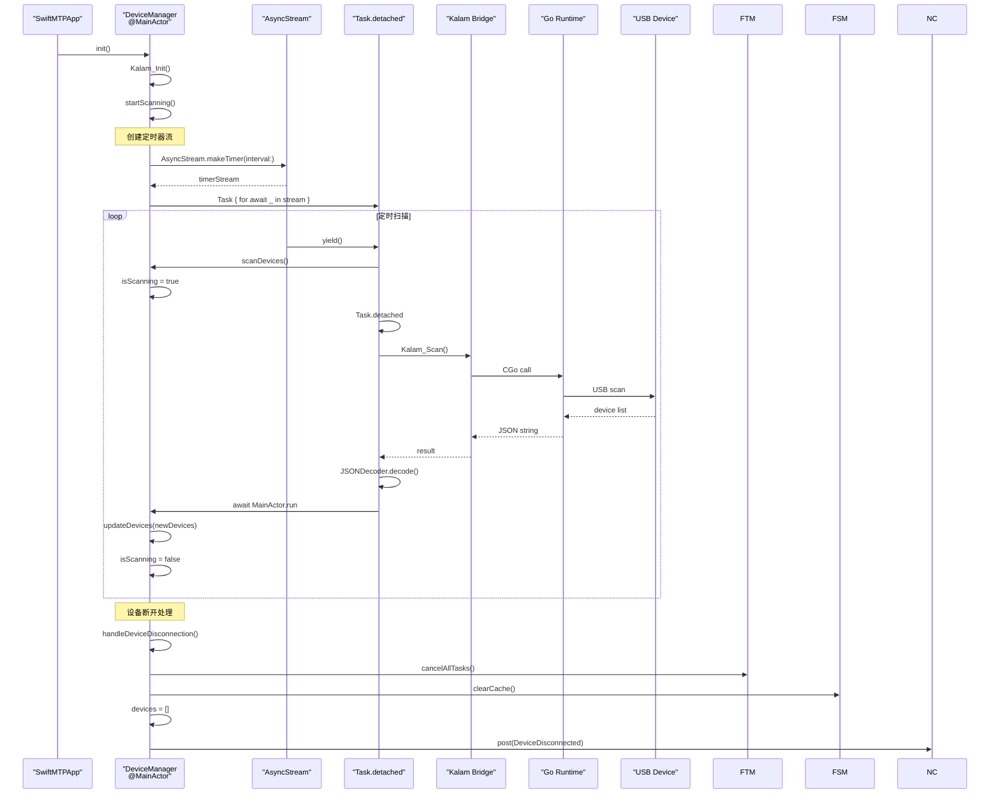
```mermaid
sequenceDiagram
    participant App as "SwiftMTPApp"
    participant DM as "DeviceManager<br/>@MainActor"
    participant Stream as "AsyncStream"
    participant Task as "Task.detached"
    participant Bridge as "Kalam Bridge"
    participant Go as "Go Runtime"
    participant USB as "USB Device"

    App->>DM: init()
    DM->>DM: Kalam_Init()
    DM->>DM: startScanning()

    Note over DM: 创建定时器流
    DM->>Stream: AsyncStream.makeTimer(interval:)
    Stream-->>DM: timerStream

    DM->>Task: Task { for await _ in stream }

    loop 定时扫描
        Stream->>Task: yield()
        Task->>DM: scanDevices()
        DM->>DM: isScanning = true

        Task->>Task: Task.detached
        Task->>Bridge: Kalam_Scan()
        Bridge->>Go: CGo call
        Go->>USB: USB scan
        USB-->>Go: device list
        Go-->>Bridge: JSON string
        Bridge-->>Task: result

        Task->>Task: JSONDecoder.decode()
        Task->>DM: await MainActor.run
        DM->>DM: updateDevices(newDevices)
        DM->>DM: isScanning = false
    end

    Note over DM: 设备断开处理
    DM->>DM: handleDeviceDisconnection()
    DM->>FTM: cancelAllTasks()
    DM->>FSM: clearCache()
    DM->>DM: devices = []
    DM->>NC: post(DeviceDisconnected)
```

### 3.2 文件浏览流程

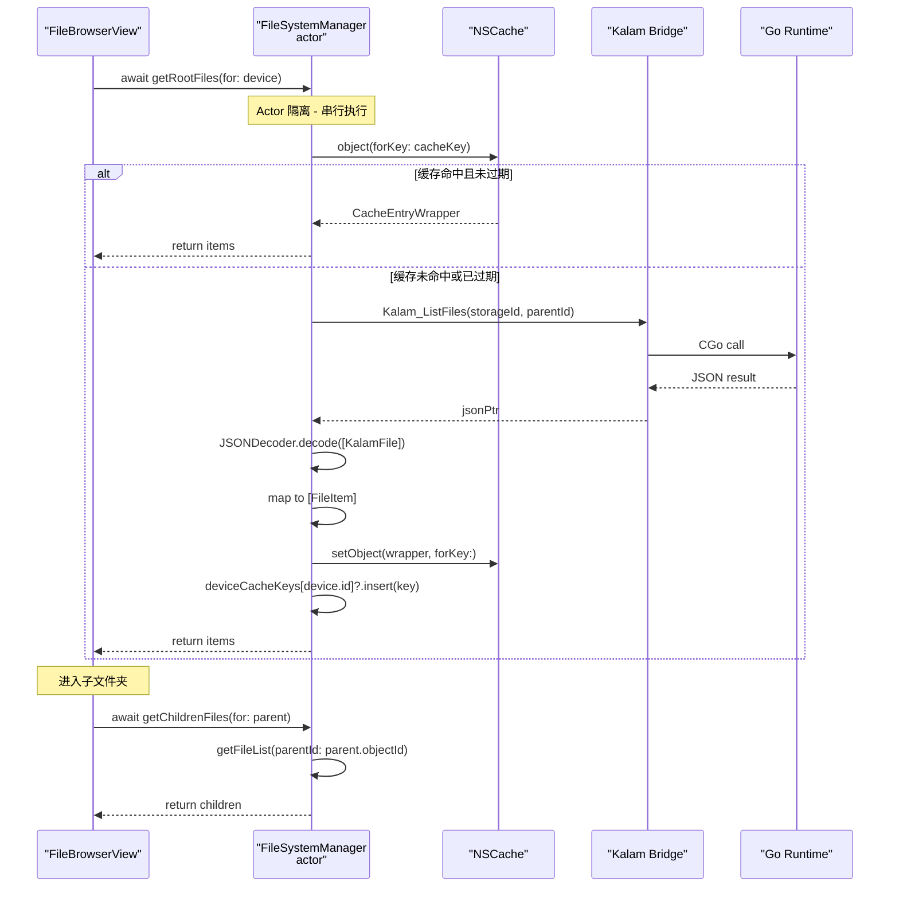
```mermaid
sequenceDiagram
    participant View as "FileBrowserView"
    participant FSM as "FileSystemManager<br/>actor"
    participant Cache as "NSCache"
    participant Bridge as "Kalam Bridge"
    participant Go as "Go Runtime"

    View->>FSM: await getRootFiles(for: device)

    Note over FSM: Actor 隔离 - 串行执行
    FSM->>Cache: object(forKey: cacheKey)

    alt 缓存命中且未过期
        Cache-->>FSM: CacheEntryWrapper
        FSM-->>View: return items
    else 缓存未命中或已过期
        FSM->>Bridge: Kalam_ListFiles(storageId, parentId)
        Bridge->>Go: CGo call
        Go-->>Bridge: JSON result
        Bridge-->>FSM: jsonPtr

        FSM->>FSM: JSONDecoder.decode([KalamFile])
        FSM->>FSM: map to [FileItem]
        FSM->>Cache: setObject(wrapper, forKey:)
        FSM->>FSM: deviceCacheKeys[device.id]?.insert(key)
        FSM-->>View: return items
    end

    Note over View: 进入子文件夹
    View->>FSM: await getChildrenFiles(for: parent)
    FSM->>FSM: getFileList(parentId: parent.objectId)
    FSM-->>View: return children
```

### 3.3 文件下载流程

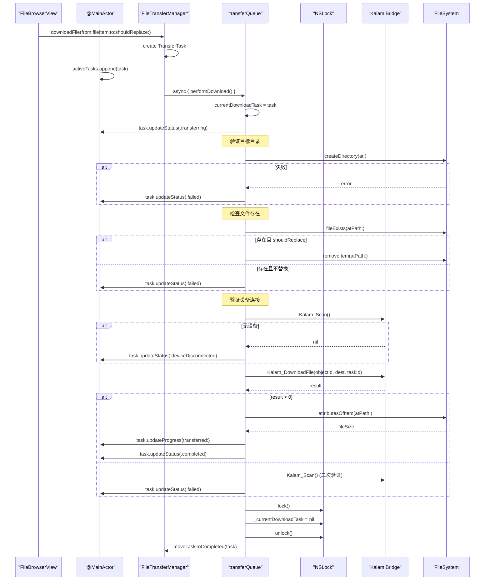
```mermaid
sequenceDiagram
    participant View as "FileBrowserView"
    participant Main as "@MainActor"
    participant FTM as "FileTransferManager"
    participant Queue as "transferQueue"
    participant Lock as "NSLock"
    participant Bridge as "Kalam Bridge"
    participant FS as "FileSystem"

    View->>FTM: downloadFile(from:fileItem:to:shouldReplace:)
    FTM->>FTM: create TransferTask
    Main->>Main: activeTasks.append(task)

    FTM->>Queue: async { performDownload() }

    Queue->>Queue: currentDownloadTask = task
    Queue->>Main: task.updateStatus(.transferring)

    Note over Queue: 验证目标目录
    Queue->>FS: createDirectory(at:)
    alt 失败
        FS-->>Queue: error
        Queue->>Main: task.updateStatus(.failed)
    end

    Note over Queue: 检查文件存在
    Queue->>FS: fileExists(atPath:)
    alt 存在且 shouldReplace
        Queue->>FS: removeItem(atPath:)
    else 存在且不替换
        Queue->>Main: task.updateStatus(.failed)
    end

    Note over Queue: 验证设备连接
    Queue->>Bridge: Kalam_Scan()
    alt 无设备
        Bridge-->>Queue: nil
        Queue->>Main: task.updateStatus(.deviceDisconnected)
    end

    Queue->>Bridge: Kalam_DownloadFile(objectId, dest, taskId)
    Bridge-->>Queue: result

    alt result > 0
        Queue->>FS: attributesOfItem(atPath:)
        FS-->>Queue: fileSize
        Queue->>Main: task.updateProgress(transferred:)
        Queue->>Main: task.updateStatus(.completed)
    else
        Queue->>Bridge: Kalam_Scan() (二次验证)
        Queue->>Main: task.updateStatus(.failed)
    end

    Queue->>Lock: lock()
    Queue->>Lock: _currentDownloadTask = nil
    Queue->>Lock: unlock()
    Queue->>FTM: moveTaskToCompleted(task)
```

### 3.4 文件上传流程

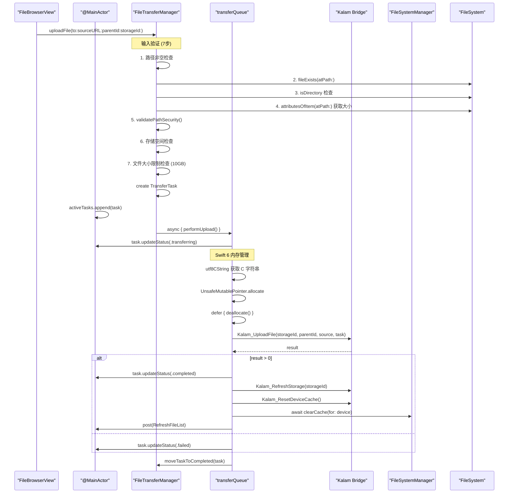
```mermaid
sequenceDiagram
    participant View as "FileBrowserView"
    participant Main as "@MainActor"
    participant FTM as "FileTransferManager"
    participant Queue as "transferQueue"
    participant Bridge as "Kalam Bridge"
    participant FSM as "FileSystemManager"
    participant FS as "FileSystem"

    View->>FTM: uploadFile(to:sourceURL:parentId:storageId:)

    Note over FTM: 输入验证 (7步)
    FTM->>FTM: 1. 路径非空检查
    FTM->>FS: 2. fileExists(atPath:)
    FTM->>FS: 3. isDirectory 检查
    FTM->>FS: 4. attributesOfItem(atPath:) 获取大小
    FTM->>FTM: 5. validatePathSecurity()
    FTM->>FTM: 6. 存储空间检查
    FTM->>FTM: 7. 文件大小限制检查 (10GB)

    FTM->>FTM: create TransferTask
    Main->>Main: activeTasks.append(task)

    FTM->>Queue: async { performUpload() }
    Queue->>Main: task.updateStatus(.transferring)

    Note over Queue: Swift 6 内存管理
    Queue->>Queue: utf8CString 获取 C 字符串
    Queue->>Queue: UnsafeMutablePointer.allocate
    Queue->>Queue: defer { deallocate() }

    Queue->>Bridge: Kalam_UploadFile(storageId, parentId, source, task)
    Bridge-->>Queue: result

    alt result > 0
        Queue->>Main: task.updateStatus(.completed)
        Queue->>Bridge: Kalam_RefreshStorage(storageId)
        Queue->>Bridge: Kalam_ResetDeviceCache()
        Queue->>FSM: await clearCache(for: device)
        Queue->>Main: post(RefreshFileList)
    else
        Queue->>Main: task.updateStatus(.failed)
    end

    Queue->>FTM: moveTaskToCompleted(task)
```

### 3.5 目录上传流程

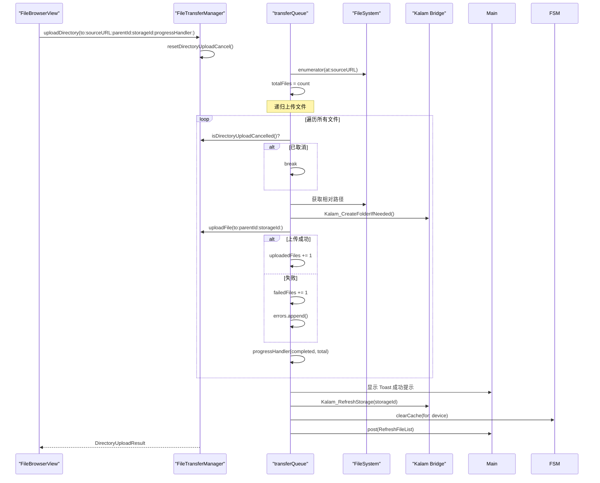
```mermaid
sequenceDiagram
    participant View as "FileBrowserView"
    participant FTM as "FileTransferManager"
    participant Queue as "transferQueue"
    participant FS as "FileSystem"
    participant Bridge as "Kalam Bridge"

    View->>FTM: uploadDirectory(to:sourceURL:parentId:storageId:progressHandler:)
    FTM->>FTM: resetDirectoryUploadCancel()

    Queue->>FS: enumerator(at:sourceURL)
    Queue->>Queue: totalFiles = count

    Note over Queue: 递归上传文件
    loop 遍历所有文件
        Queue->>FTM: isDirectoryUploadCancelled()?
        alt 已取消
            Queue->>Queue: break
        end

        Queue->>FS: 获取相对路径
        Queue->>Bridge: Kalam_CreateFolderIfNeeded()
        Queue->>FTM: uploadFile(to:parentId:storageId:)

        alt 上传成功
            Queue->>Queue: uploadedFiles += 1
        else 失败
            Queue->>Queue: failedFiles += 1
            Queue->>Queue: errors.append()
        end

        Queue->>Queue: progressHandler(completed, total)
    end

    Queue->>Main: 显示 Toast 成功提示
    Queue->>Bridge: Kalam_RefreshStorage(storageId)
    Queue->>FSM: clearCache(for: device)
    Queue->>Main: post(RefreshFileList)

    FTM-->>View: DirectoryUploadResult
```

### 3.6 Toast 提示流程

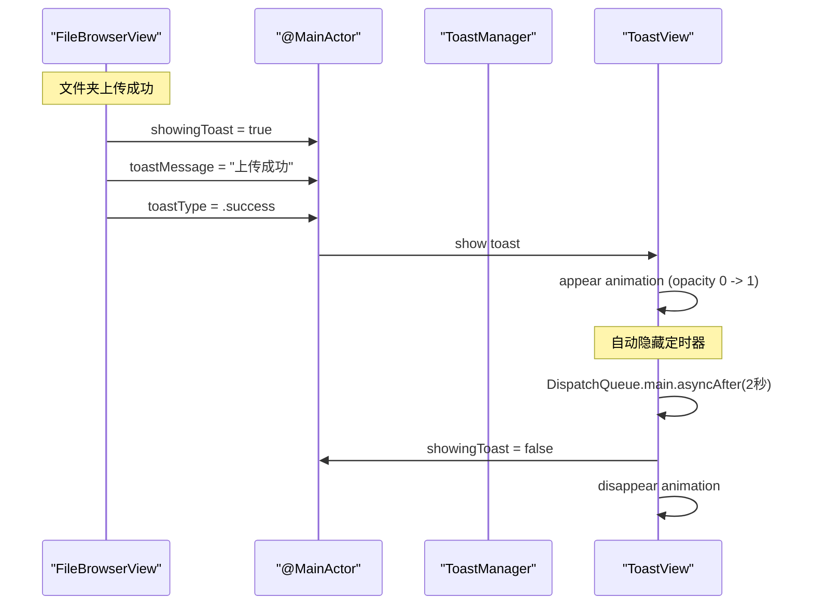
```mermaid
sequenceDiagram
    participant View as "FileBrowserView"
    participant Main as "@MainActor"
    participant Toast as "ToastManager"
    participant UI as "ToastView"

    Note over View: 文件夹上传成功
    View->>Main: showingToast = true
    View->>Main: toastMessage = "上传成功"
    View->>Main: toastType = .success

    Main->>UI: show toast
    UI->>UI: appear animation (opacity 0 -> 1)

    Note over UI: 自动隐藏定时器
    UI->>UI: DispatchQueue.main.asyncAfter(2秒)
    UI->>Main: showingToast = false
    UI->>UI: disappear animation
```

---

## 4. 线程模型图

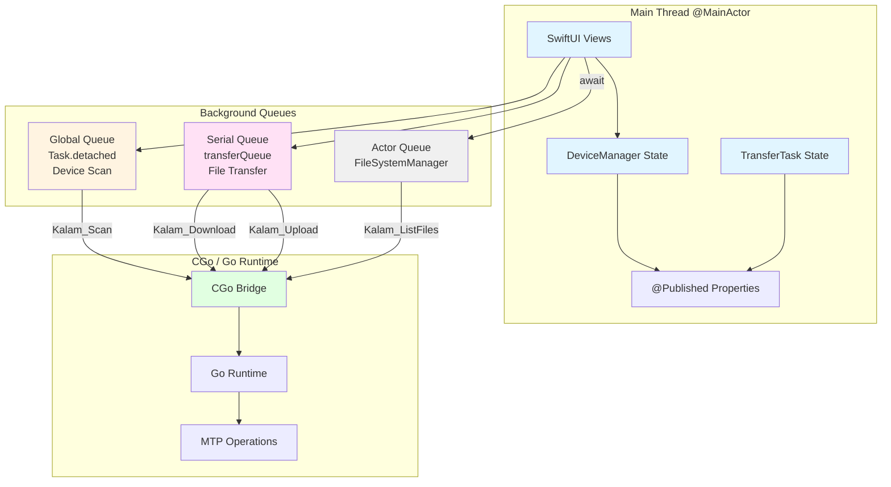
```mermaid
flowchart TB
    subgraph "Main Thread @MainActor"
        UI["SwiftUI Views"]
        DM_STATE["DeviceManager State"]
        TASK_STATE["TransferTask State"]
        PUBLISHED["@Published Properties"]
    end

    subgraph "Background Queues"
        direction TB
        SCAN_QUEUE["Global Queue<br/>Task.detached<br/>Device Scan"]
        TRANSFER_QUEUE["Serial Queue<br/>transferQueue<br/>File Transfer"]
        ACTOR["Actor Queue<br/>FileSystemManager"]
    end

    subgraph "CGo / Go Runtime"
        CGO["CGo Bridge"]
        GO["Go Runtime"]
        MTP["MTP Operations"]
    end

    UI --> DM_STATE
    DM_STATE --> PUBLISHED
    TASK_STATE --> PUBLISHED

    UI -->|await| ACTOR
    UI --> SCAN_QUEUE
    UI --> TRANSFER_QUEUE

    SCAN_QUEUE -->|Kalam_Scan| CGO
    TRANSFER_QUEUE -->|Kalam_Download| CGO
    TRANSFER_QUEUE -->|Kalam_Upload| CGO
    ACTOR -->|Kalam_ListFiles| CGO

    CGO --> GO
    GO --> MTP

    style UI fill:#e1f5ff
    style DM_STATE fill:#e1f5ff
    style TASK_STATE fill:#e1f5ff
    style SCAN_QUEUE fill:#fff4e1
    style TRANSFER_QUEUE fill:#ffe1f5
    style ACTOR fill:#f0f0f0
    style CGO fill:#e1ffe1
```

---

## 5. 状态流转图

### 5.1 传输任务状态机

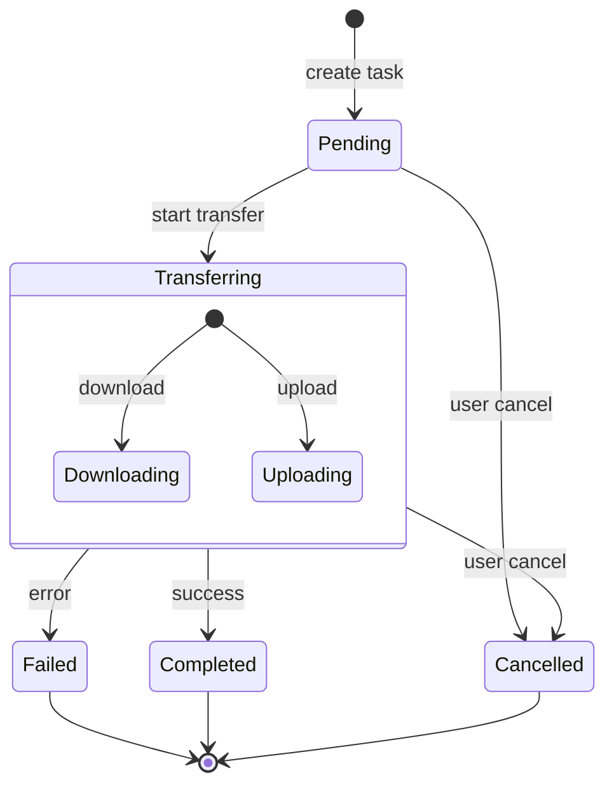
```mermaid
stateDiagram-v2
    [*] --> Pending: create task
    Pending --> Transferring: start transfer
    Transferring --> Completed: success
    Transferring --> Failed: error
    Transferring --> Cancelled: user cancel
    Pending --> Cancelled: user cancel
    Failed --> [*]
    Completed --> [*]
    Cancelled --> [*]

    state Transferring {
        [*] --> Downloading: download
        [*] --> Uploading: upload
    }
```

### 5.2 设备连接状态机

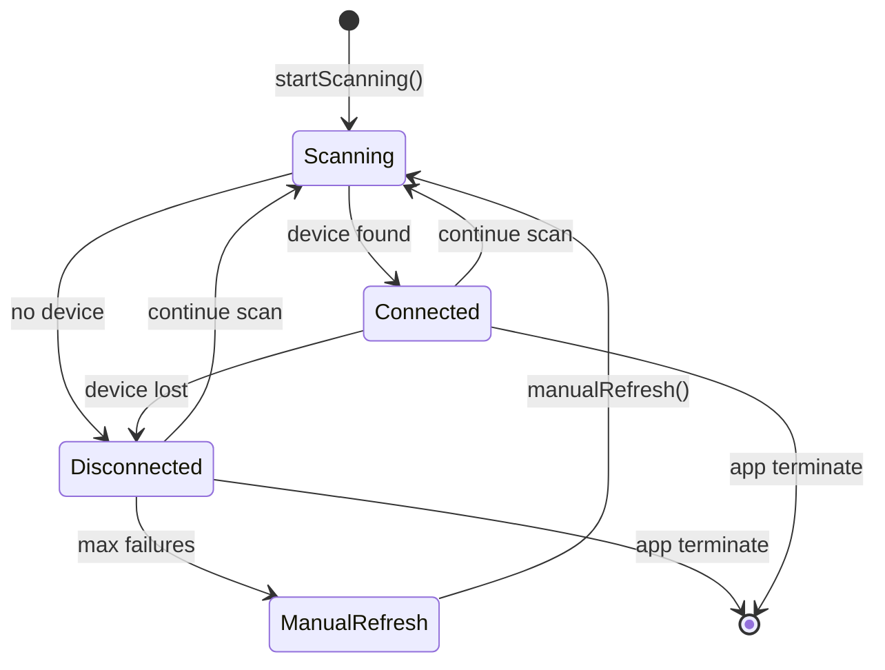
```mermaid
stateDiagram-v2
    [*] --> Scanning: startScanning()
    Scanning --> Connected: device found
    Scanning --> Disconnected: no device
    Connected --> Scanning: continue scan
    Disconnected --> Scanning: continue scan
    Connected --> Disconnected: device lost
    Disconnected --> ManualRefresh: max failures
    ManualRefresh --> Scanning: manualRefresh()
    Disconnected --> [*]: app terminate
    Connected --> [*]: app terminate
```

---

## 6. 缓存架构图

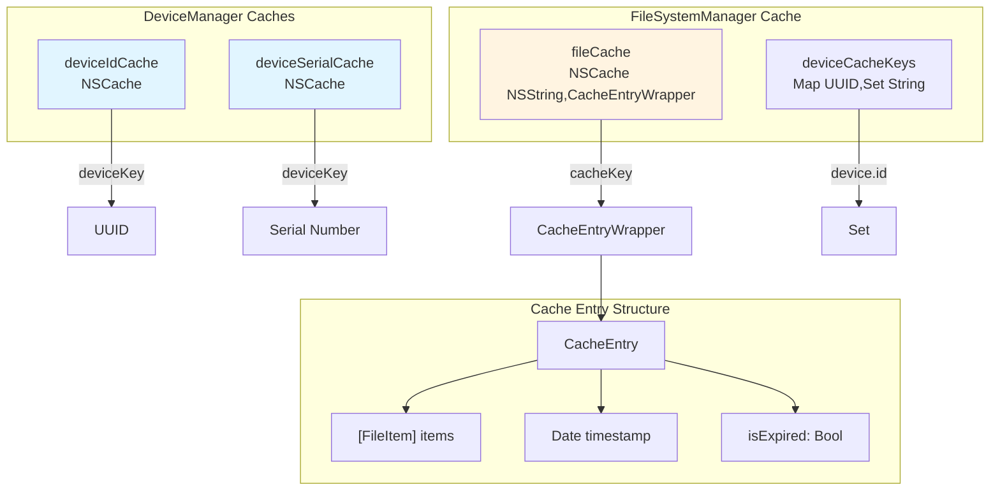
```mermaid
flowchart TB
    subgraph "DeviceManager Caches"
        D_CACHE["deviceIdCache<br/>NSCache<NSNumber, UUIDWrapper>"]
        S_CACHE["deviceSerialCache<br/>NSCache<NSNumber, NSString>"]
    end

    subgraph "FileSystemManager Cache"
        F_CACHE["fileCache<br/>NSCache NSString,CacheEntryWrapper"]
        KEY_MAP["deviceCacheKeys<br/>Map UUID,Set String"]
    end

    subgraph "Cache Entry Structure"
        ENTRY["CacheEntry"]
        ITEMS["[FileItem] items"]
        TIME["Date timestamp"]
        EXPIRED["isExpired: Bool"]
    end

    D_CACHE -->|deviceKey| UUID["UUID"]
    S_CACHE -->|deviceKey| SERIAL["Serial Number"]

    F_CACHE -->|cacheKey| WRAPPER["CacheEntryWrapper"]
    WRAPPER --> ENTRY
    ENTRY --> ITEMS
    ENTRY --> TIME
    ENTRY --> EXPIRED

    KEY_MAP -->|device.id| KEYS["Set<cacheKey>"]

    style D_CACHE fill:#e1f5ff
    style S_CACHE fill:#e1f5ff
    style F_CACHE fill:#fff4e1
```

---

## 7. 语言管理架构

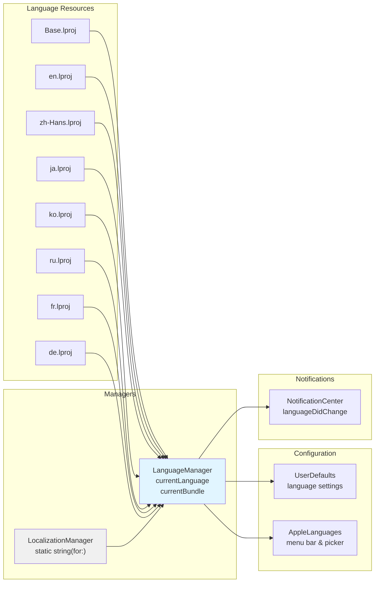
```mermaid
flowchart LR
    subgraph "Language Resources"
        BASE["Base.lproj"]
        EN["en.lproj"]
        ZH["zh-Hans.lproj"]
        JA["ja.lproj"]
        KO["ko.lproj"]
        RU["ru.lproj"]
        FR["fr.lproj"]
        DE["de.lproj"]
    end

    subgraph "Managers"
        LM["LanguageManager<br/>currentLanguage<br/>currentBundle"]
        L10N["LocalizationManager<br/>static string(for:)"]
    end

    subgraph "Configuration"
        UD["UserDefaults<br/>language settings"]
        AL["AppleLanguages<br/>menu bar & picker"]
    end

    subgraph "Notifications"
        NC["NotificationCenter<br/>languageDidChange"]
    end

    BASE --> LM
    EN --> LM
    ZH --> LM
    JA --> LM
    KO --> LM
    RU --> LM
    FR --> LM
    DE --> LM

    LM --> UD
    LM --> AL
    LM --> NC
    L10N --> LM

    style LM fill:#e1f5ff
    style L10N fill:#f0f0f0
```

---

## 8. 安全验证流程

### 8.1 上传路径安全验证

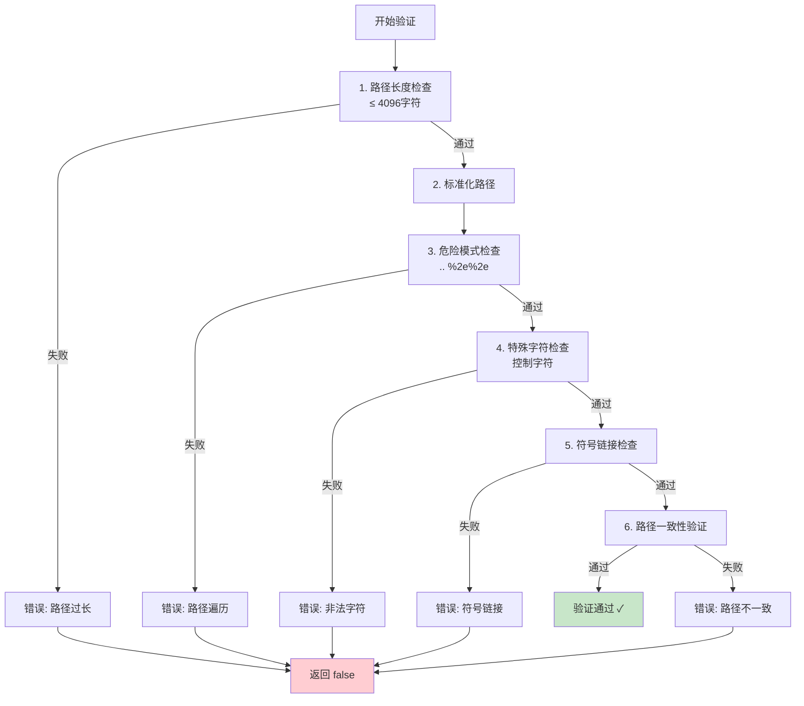
```mermaid
flowchart TD
    START["开始验证"] --> STEP1["1. 路径长度检查<br/>≤ 4096字符"]
    STEP1 -->|通过| STEP2["2. 标准化路径"]
    STEP1 -->|失败| ERR1["错误: 路径过长"]

    STEP2 --> STEP3["3. 危险模式检查<br/>.. %2e%2e"]
    STEP3 -->|通过| STEP4["4. 特殊字符检查<br/>控制字符"]
    STEP3 -->|失败| ERR2["错误: 路径遍历"]

    STEP4 -->|通过| STEP5["5. 符号链接检查"]
    STEP4 -->|失败| ERR3["错误: 非法字符"]

    STEP5 -->|通过| STEP6["6. 路径一致性验证"]
    STEP5 -->|失败| ERR4["错误: 符号链接"]

    STEP6 -->|通过| SUCCESS["验证通过 ✓"]
    STEP6 -->|失败| ERR5["错误: 路径不一致"]

    ERR1 --> FAIL["返回 false"]
    ERR2 --> FAIL
    ERR3 --> FAIL
    ERR4 --> FAIL
    ERR5 --> FAIL

    style SUCCESS fill:#C8E6C9
    style FAIL fill:#FFCDD2
```

---

## 9. 模块依赖图

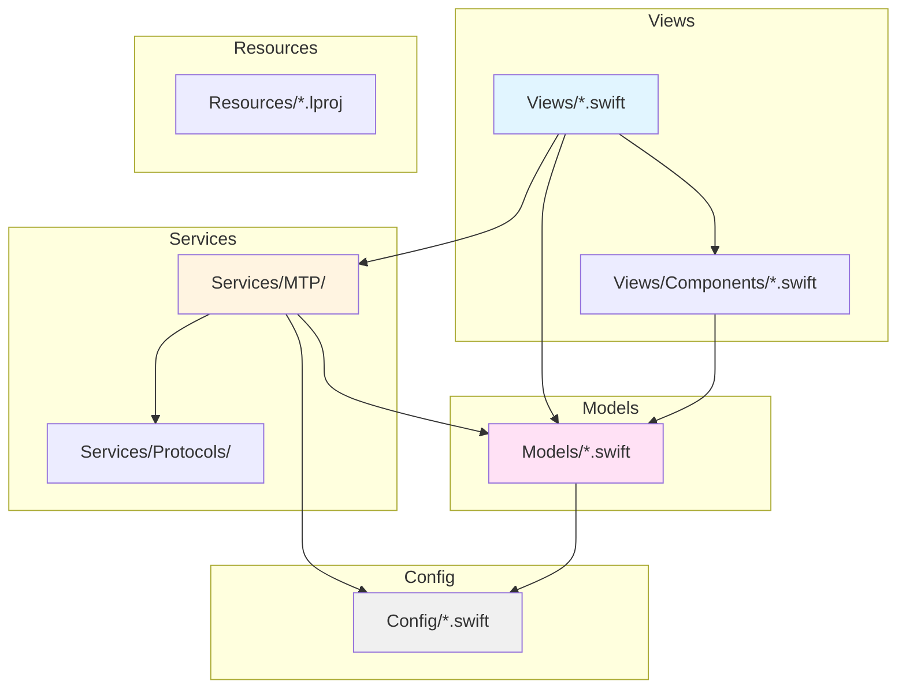
```mermaid
flowchart TB
    subgraph "Views"
        VIEWS["Views/*.swift"]
        COMP["Views/Components/*.swift"]
    end

    subgraph "Services"
        MTP["Services/MTP/"]
        PROTO["Services/Protocols/"]
    end

    subgraph "Models"
        MODELS["Models/*.swift"]
    end

    subgraph "Config"
        CONFIG["Config/*.swift"]
    end

    subgraph "Resources"
        RES["Resources/*.lproj"]
    end

    VIEWS --> MTP
    VIEWS --> MODELS
    VIEWS --> COMP
    COMP --> MODELS

    MTP --> MODELS
    MTP --> PROTO
    MTP --> CONFIG

    MODELS --> CONFIG

    style VIEWS fill:#e1f5ff
    style MTP fill:#fff4e1
    style MODELS fill:#ffe1f5
    style CONFIG fill:#f0f0f0
```

---

## 10. 数据流图

### 10.1 文件下载数据流

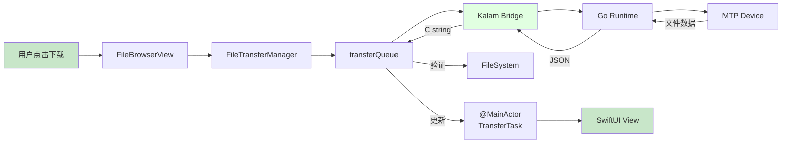
```mermaid
flowchart LR
    A["用户点击下载"] --> B["FileBrowserView"]
    B --> C["FileTransferManager"]
    C --> D["transferQueue"]
    D --> E["Kalam Bridge"]
    E --> F["Go Runtime"]
    F --> G["MTP Device"]
    G -->|文件数据| F
    F -->|JSON| E
    E -->|C string| D
    D -->|验证| H["FileSystem"]
    D -->|更新| I["@MainActor<br/>TransferTask"]
    I --> J["SwiftUI View"]

    style A fill:#C8E6C9
    style J fill:#C8E6C9
    style E fill:#e1ffe1
```

### 10.2 文件上传数据流

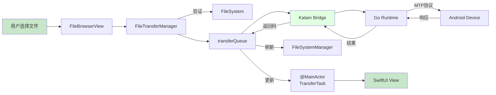
```mermaid
flowchart LR
    A["用户选择文件"] --> B["FileBrowserView"]
    B --> C["FileTransferManager"]
    C -->|验证| D["FileSystem"]
    C --> E["transferQueue"]
    E --> F["Kalam Bridge"]
    F --> G["Go Runtime"]
    G -->|MTP协议| H["Android Device"]
    H -->|响应| G
    G -->|结果| F
    F -->|返回码| E
    E -->|刷新| I["FileSystemManager"]
    E -->|更新| J["@MainActor<br/>TransferTask"]
    J --> K["SwiftUI View"]

    style A fill:#C8E6C9
    style K fill:#C8E6C9
    style F fill:#e1ffe1
```
