# SwiftMTP 时序图

## 1. 语言切换时序图

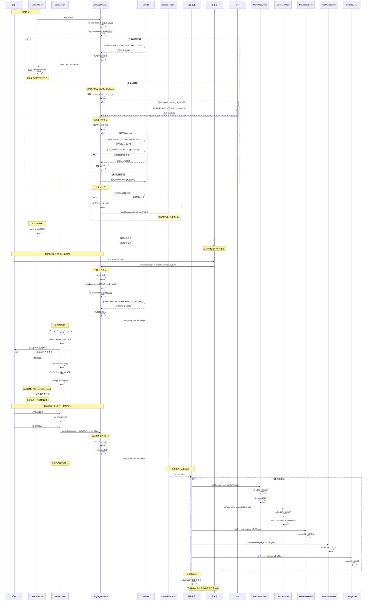

## 2. 设备检测时序图

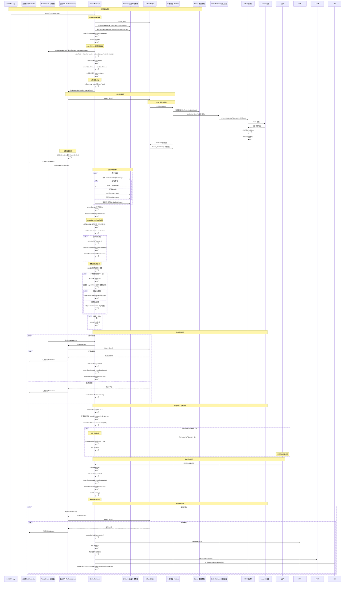

## 3. 文件浏览时序图

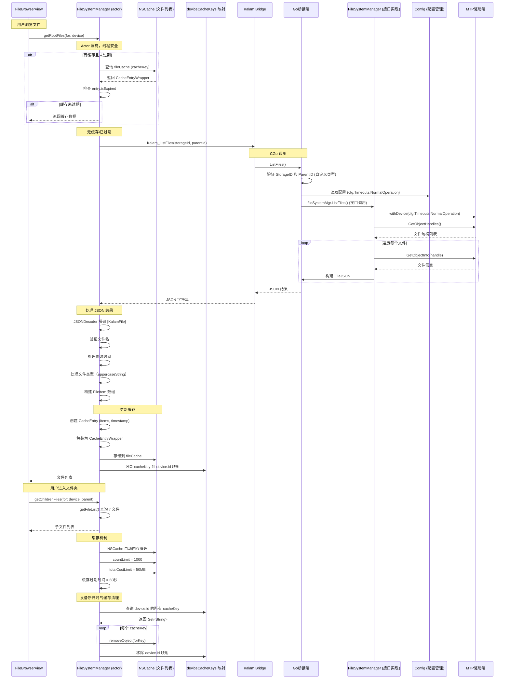

## 4. 文件下载时序图

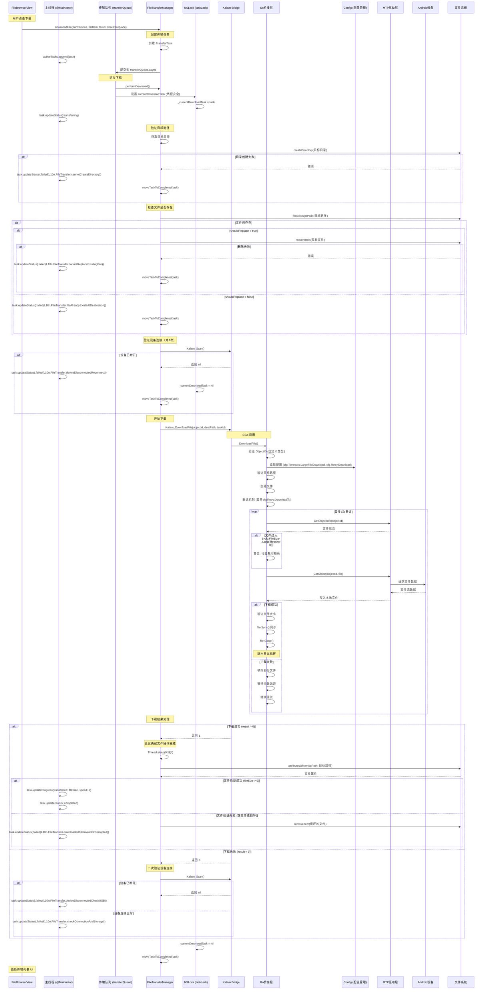

## 5. 文件上传时序图

```mermaid
sequenceDiagram
    participant View as FileBrowserView
    participant MainThread as 主线程 (@MainActor)
    participant TransferQueue as 传输队列 (transferQueue)
    participant FTM as FileTransferManager
    participant Bridge as Kalam Bridge
    participant Go as Go桥接层
    participant GoConfig as Config (配置管理)
    participant MTP as MTP驱动层
    participant Device as Android设备
    participant FS as 文件系统
    participant FSM as FileSystemManager (actor)

    Note over View: 用户选择上传文件
    View->>FTM: uploadFile(to:device, sourceURL, parentId, storageId)

    Note over FTM: 输入验证 - 第1步：路径验证
    FTM->>FTM: 检查路径是否为空
    alt 路径为空
        Note over FTM: 返回错误（日志记录）
    end

    Note over FTM: 输入验证 - 第2步：文件存在性
    FTM->>FS: fileExists(atPath: sourceURL)
    alt 文件不存在
        FS-->>FTM: false
        Note over FTM: 返回错误（日志记录）
    end

    Note over FTM: 输入验证 - 第3步：目录检查
    FTM->>FS: fileExists(atPath: sourceURL, isDirectory)
    alt 是目录
        FS-->>FTM: true
        Note over FTM: 返回错误（不支持目录上传）
    end

    Note over FTM: 输入验证 - 第4步：文件大小
    FTM->>FS: attributesOfItem(atPath: sourceURL)
    FS-->>FTM: 文件属性
    alt 获取文件大小失败
        Note over FTM: 返回错误（日志记录）
    else 文件大小 > cfg.FileSize.MaxFileSize
        Note over FTM: 返回错误（文件过大）
    end

    Note over FTM: 输入验证 - 第5步：路径安全验证
    FTM->>FTM: validatePathSecurity(sourceURL)
    Note over FTM: 包含以下检查：
    Note over FTM: - 路径长度限制（cfg.Security.MaxPathLength）
    Note over FTM: - 路径遍历攻击检查（禁止 ".." 及其编码形式）
    Note over FTM: - 特殊字符检查（禁止控制字符）
    Note over FTM: - 符号链接检查（禁止符号链接）
    Note over FTM: - 允许目录范围验证（仅允许 Downloads、Desktop、Documents）
    Note over FTM: - 路径标准化验证（确保无相对引用）
    alt 验证失败
        Note over FTM: 返回错误（日志记录详细步骤）
    end

    Note over FTM: 输入验证 - 第6步：存储空间检查
    FTM->>FTM: 查找设备存储 (storageId)
    alt 存储未找到
        Note over FTM: 返回错误（存储不存在）
    end
    alt 文件大小 > 存储可用空间
        Note over FTM: 返回错误（设备存储空间不足）
    end

    Note over FTM: 创建任务并执行
    FTM->>FTM: 创建 TransferTask
    MainThread->>MainThread: activeTasks.append(task)
    FTM->>TransferQueue: 提交到 transferQueue.async

    TransferQueue->>FTM: performUpload()
    MainThread->>MainThread: task.updateStatus(.transferring)

    Note over FTM: 验证文件属性
    FTM->>FS: attributesOfItem(atPath: sourceURL)
    FS-->>FTM: 文件属性
    alt 获取文件属性失败
        MainThread->>MainThread: task.updateStatus(.failed(L10n.FileTransfer.cannotReadFileInfo))
        FTM->>FTM: moveTaskToCompleted(task)
    end

    Note over FTM: 检查任务取消状态
    alt task.isCancelled
        MainThread->>MainThread: task.updateStatus(.cancelled)
        FTM->>FTM: moveTaskToCompleted(task)
    end

    Note over FTM: Swift 6 内存管理 (defer保护)
    FTM->>FTM: 使用 utf8CString 获取 C 字符串数组
    FTM->>FTM: 手动分配内存（UnsafeMutablePointer）
    FTM->>FTM: 复制字符串内容到 C 指针
    Note over FTM: defer 块确保内存释放
    FTM->>FTM: defer { mutableSource.deallocate() }
    FTM->>FTM: defer { mutableTask.deallocate() }

    Note over FTM: 开始上传
    FTM->>Bridge: Kalam_UploadFile(storageId, parentId, sourcePath, taskId)

    Note over Bridge,Go: CGo 调用
    Bridge->>Go: UploadFile()

    Go->>Go: 验证 StorageID 和 ParentID (自定义类型)
    Go->>Go: 验证源文件存在
    Go->>GoConfig: 读取配置 (cfg.Timeouts.NormalOperation)
    Go->>Go: withDevice(cfg.Timeouts.NormalOperation) 连接设备

    Note over Go: Step 1 - 发送对象信息
    Go->>MTP: SendObjectInfo(storageId, parentId, &objInfo)
    MTP->>Device: 发送文件元数据
    Device-->>MTP: 确认接收
    MTP-->>Go: 返回新对象句柄

    Note over Go: Step 2 - 发送文件数据
    Go->>MTP: SendObject(objectHandle, file)
    MTP->>Device: 传输文件数据流
    Device-->>MTP: 确认完成
    MTP-->>Go: 传输结果

    alt 用户取消任务
        View->>FTM: cancelTask(task)
        FTM->>Bridge: Kalam_CancelTask(taskId)
        Bridge->>Go: 设置取消标记
        Go->>Go: isTaskCancelled() 检查
        Note over Go: 停止传输
    end

    Note over FTM: Swift 6 内存清理
    FTM->>FTM: defer 块执行
    FTM->>FTM: mutableSource.deallocate()
    FTM->>FTM: mutableTask.deallocate()

    Note over FTM: 上传完成处理
    Bridge-->>FTM: 返回结果

    alt 上传成功 (result > 0)
        MainThread->>MainThread: task.updateProgress(transferred: fileSize, speed: 0)
        MainThread->>MainThread: task.updateStatus(.completed)

        Note over FTM: 刷新设备存储
        FTM->>Bridge: Kalam_RefreshStorage(storageId)
        Bridge-->>FTM: 刷新结果

        Note over FTM: 重置设备缓存
        FTM->>Bridge: Kalam_ResetDeviceCache()
        Bridge-->>FTM: 重置结果

        Note over FSM: 清除文件系统缓存
        FTM->>FSM: clearCache(for: device)
        FTM->>FSM: forceClearCache()

        Note over FTM: 发送刷新通知
        MainThread->>MainThread: 延迟1秒发送 RefreshFileList 通知
        Note over View: 刷新文件列表
    else 上传失败 (result = 0)
        MainThread->>MainThread: task.updateStatus(.failed(L10n.FileTransfer.uploadFailed))
        Note over FTM: 检查设备连接状态
        FTM->>Bridge: Kalam_Scan()
    end

    FTM->>FTM: moveTaskToCompleted(task)
    Note over View: 更新传输列表 UI
```

## 6. 核心组件交互关系图

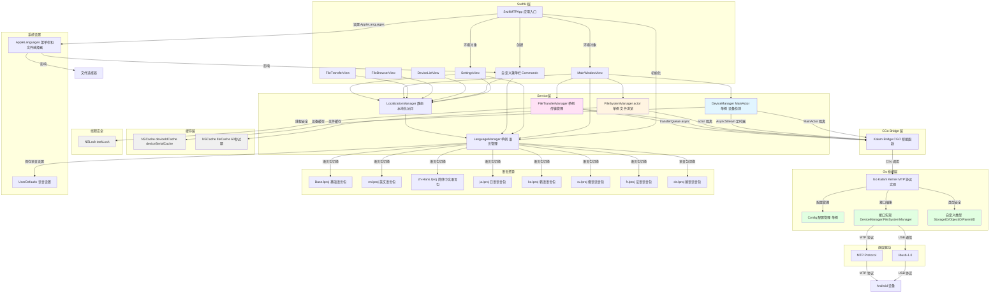

## 7. 线程模型时序图

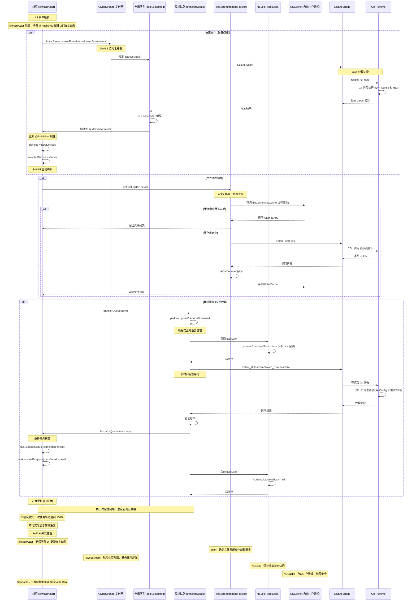

## 线程模型详细说明

### 队列职责

| 队列 | 类型 | 用途 | QoS | 典型操作 |
|------|------|------|-----|----------|
| 主线程 (@MainActor) | 串行 | UI 更新、用户交互 | - | 更新 @Published 属性、SwiftUI 刷新 |
| AsyncStream (定时器) | 并发 | 设备扫描定时器 | - | 触发 scanDevices() |
| 全局队列 (Task.detached) | 并发 | 后台快速操作 | .userInitiated | 设备扫描、文件列表获取 |
| 传输队列 (transferQueue) | 串行 | 文件传输操作 | .userInitiated | 文件下载、文件上传 |
| Actor (FileSystemManager) | 串行 | 文件系统操作 | - | 文件列表获取、缓存管理 |

### 线程切换流程

1. **主线程 → AsyncStream**
   - 用户操作触发
   - `AsyncStream.makeTimer(interval:)` (Swift 6 现代化定时器)
   - 定时触发后台任务

2. **AsyncStream → 全局队列/传输队列**
   - `Task.detached(priority: .userInitiated)` (Swift 6 结构化并发)
   - `transferQueue.async`

3. **后台队列 → CGo Bridge**
   - 调用 C 函数（阻塞）
   - CGo 自动切换到 Go runtime 线程

4. **Go Runtime → CGo Bridge**
   - Go 协程执行完成（使用 Config 和接口）
   - 返回结果到 Swift

5. **CGo Bridge → 后台队列**
   - 接收返回结果
   - 处理数据（JSON 解码等）

6. **后台队列 → 主线程**
   - `await MainActor.run` (Swift 6)
   - 更新 UI 状态

7. **主线程 → Actor**
   - `await FileSystemManager.shared.getFileList()`
   - Actor 隔离确保线程安全

### Swift 6 并发特性

1. **@MainActor 隔离**
   - `DeviceManager` 使用 `@MainActor` 标记
   - 确保所有属性访问和方法调用在主线程执行
   - 编译器强制检查，防止数据竞争

2. **Actor 隔离**
   - `FileSystemManager` 使用 `actor` 标记
   - 确保所有方法调用串行化执行
   - 编译器强制检查，防止并发访问

3. **AsyncStream**
   - `DeviceManager` 使用 `AsyncStream` 替代 Timer
   - 现代化定时器，避免线程泄漏
   - 更好的取消机制

4. **Sendable 协议**
   - 所有模型实现 `Sendable` 协议
   - 支持跨线程传递
   - 编译器验证线程安全性

5. **Task.detached**
   - 使用结构化并发进行后台操作
   - 避免数据竞争
   - 支持优先级设置

6. **NSLock 线程安全**
   - `FileTransferManager` 使用 `NSLock` 保护 `currentDownloadTask`
   - 手动管理锁，确保线程安全

7. **NSCache 自动内存管理**
   - `DeviceManager` 和 `FileSystemManager` 使用 `NSCache`
   - 自动内存管理，线程安全
   - 支持内存压力响应

### Go 层特性

1. **Config 配置管理**
   - 单一数据源管理所有配置
   - 支持 Timeouts、Retries、Backoff、Security、Pool、FileSize 等配置分组
   - 默认值和环境变量覆盖支持

2. **自定义类型**
   - `StorageID`、`ObjectID`、`ParentID` 防止参数混淆
   - 包含 `Validate()` 方法进行运行时验证
   - 包含 `String()` 方法提供友好的日志输出

3. **接口抽象**
   - `DeviceManager` 接口定义设备操作契约
   - `FileSystemManager` 接口定义文件系统操作契约
   - 提高代码可测试性和可维护性

4. **改进的错误处理**
   - 返回错误码（0xFFFFFFFF、0xFFFFFFFE等）
   - 返回错误JSON（包含错误类型和消息）
   - Swift层可以获取详细的错误信息

5. **Typed throws (Swift)**
   - 所有错误类型支持本地化
   - 50+个本地化键支持多语言
   - 使用 `NSLocalizedString` 确保国际化支持

### 进度回调机制

**当前状态**: 已禁用

**禁用原因**:
- 稳定性问题：进度回调可能导致传输过程中断或崩溃
- 性能影响：频繁的跨线程调用增加开销
- 用户体验：进度更新不准确，不如等待完成后一次性更新

**替代方案**:
- 传输完成后一次性更新进度到 100%
- 显示传输状态（transferring、completed、failed）
- 提供文件大小和传输时间信息

**未来改进方向**:
- 实现更稳定的进度回调机制
- 使用批处理减少回调频率
- 添加传输速度估算

### 线程安全机制

1. **@MainActor**
   - `DeviceManager` 所有属性和方法都在主线程
   - 编译器强制检查

2. **Actor**
   - `FileSystemManager` 所有方法串行化执行
   - 编译器强制检查

3. **AsyncStream**
   - `DeviceManager` 使用 AsyncStream 进行定时操作
   - 避免线程泄漏

4. **NSLock**
   - `FileTransferManager` 使用 `NSLock` 保护 `currentDownloadTask`
   - 手动管理锁

5. **NSCache**
   - `DeviceManager` 和 `FileSystemManager` 使用 `NSCache`
   - 自动线程安全

6. **Sendable**
   - 所有模型实现 `Sendable` 协议
   - 支持跨线程传递

7. **原子操作**
   - `isCancelled` 标志
   - 任务状态更新

### 性能优化

1. **缓存策略**
   - 文件列表缓存 60 秒
   - 设备 ID 和序列号缓存（NSCache 自动内存管理）
   - 减少重复的设备查询

2. **自适应扫描**
   - 无设备时使用指数退避
   - 有设备时使用用户设置的扫描间隔（默认3秒）
   - 用户可在设置中调整扫描间隔（1-10秒）
   - 使用 AsyncStream 避免线程泄漏

3. **队列优先级**
   - 使用 `.userInitiated` QoS
   - 平衡响应速度和系统资源

4. **批量操作**
   - 文件列表一次性获取
   - 减少设备通信次数

5. **结构化并发**
   - 使用 `Task.detached` 进行后台操作
   - 避免数据竞争
   - 更好的性能和可维护性

6. **配置管理**
   - 集中配置到 Config 结构
   - 减少全局变量
   - 支持配置热重载（未来）

## 关键交互总结

| 场景 | 发起方 | 桥接层 | Go层 | 线程处理 | 特殊处理 | 新增特性 |
|------|--------|--------|------|----------|----------|----------|
| 设备扫描 | DeviceManager (@MainActor) | Kalam_Scan | deviceMgr.Scan() (接口) | AsyncStream → Task.detached → @MainActor | 指数退避策略、手动刷新、用户可配置扫描间隔、NSCache 缓存 | AsyncStream定时器、接口抽象、Config配置、类型验证 |
| 文件浏览 | FileSystemManager (actor) | Kalam_ListFiles | fileSystemMgr.ListFiles() (接口) | Actor 隔离 | NSCache 自动内存管理、60秒过期、设备级缓存清理 | 接口抽象、Config配置、类型验证 |
| 文件下载 | FileTransferManager | Kalam_DownloadFile | withDevice + 重试 | transferQueue → @MainActor | 设备连接验证（下载前和失败后）、NSLock 保护、文件验证 | Config配置、类型验证、改进的错误处理 |
| 文件上传 | FileTransferManager | Kalam_UploadFile | withDevice | transferQueue → @MainActor | 7步输入验证、Swift 6 内存管理（defer）、上传后刷新 | Config配置、类型验证、改进的内存管理 |
| 设备断开 | DeviceManager (@MainActor) | Kalam_Scan 返回空 | - | @MainActor 处理通知 | 取消所有任务、清除设备序列号缓存、清除文件系统缓存 | - |
| 手动刷新 | 用户 | - | - | @MainActor | 重置失败计数、重启扫描 | - |
| 语言切换 (菜单栏) | SwiftMTPApp | - | - | @MainActor + 通知机制 | 多语言支持（7种语言）、系统默认模式 | Typed throws、本地化支持 |
| 语言切换 (设置) | SettingsView | - | - | @MainActor + 通知机制 | 语言包验证、回退机制 | Typed throws、本地化支持 |
| 应用重启 | SettingsView | - | - | Process + NSApp.terminate | AppleLanguages 设置 | - |
| 本地化访问 | 各视图 | - | - | 计算属性实时获取 | L10n 本地化字符串 | Typed throws、本地化支持 |

## 新增功能说明

### 1. Swift 6 并发特性
- **@MainActor 隔离**: `DeviceManager` 使用 `@MainActor` 确保所有 UI 相关操作在主线程执行
- **Actor 隔离**: `FileSystemManager` 使用 `actor` 确保文件系统操作线程安全
- **Sendable 协议**: 所有模型（`Device`、`FileItem`、`StorageInfo`、`MTPSupportInfo`、`TransferTask`）都实现 `Sendable` 协议，支持跨线程传递
- **Task.detached**: 使用结构化并发（`Task.detached`）进行后台操作，避免数据竞争
- **AsyncStream**: `DeviceManager` 使用 `AsyncStream` 替代 Timer，避免线程泄漏
- **NSLock 线程安全**: `FileTransferManager` 使用 `NSLock` 保护 `currentDownloadTask` 访问

### 2. Go 层改进
- **Config 配置管理**: 单一数据源管理所有配置（Timeouts、Retries、Backoff、Security、Pool、FileSize）
- **自定义类型**: `StorageID`、`ObjectID`、`ParentID` 防止参数混淆，包含 `Validate()` 和 `String()` 方法
- **接口抽象**: `DeviceManager` 和 `FileSystemManager` 接口定义行为契约，提高可测试性
- **改进的错误处理**: 返回错误码和错误JSON，Swift层可以获取详细的错误信息

### 3. Typed throws 系统
- **错误类型**: `MTPError`、`FileSystemError`、`TransferError`、`ConfigurationError`、`ScanError`
- **本地化支持**: 所有错误类型使用 `NSLocalizedString` 支持 7 种语言
- **错误分类**: 50+个本地化键，支持格式化字符串
- **可恢复性判断**: `isRecoverable` 属性帮助 UI 层决定是否提供重试选项

### 4. NSCache 缓存机制
- **设备缓存**:
  - `deviceIdCache`: 缓存设备 ID 到 UUID 的映射（NSCache 自动内存管理）
  - `deviceSerialCache`: 缓存设备序列号，用于设备断开检测
  - 使用序列号而不是 UUID 来检测设备断开，更可靠
- **文件缓存**:
  - `fileCache`: 缓存文件列表（60秒过期）
  - `deviceCacheKeys`: 映射设备 ID 到缓存键，支持精确清理
  - 自动内存管理：`countLimit = 1000`，`totalCostLimit = 50MB`

### 5. 指数退避策略（设备扫描）
- **目的**: 减少无设备时的扫描频率，节省系统资源
- **机制**:
  - 初始间隔: 用户设置的值（默认3秒）
  - 每次失败后: `interval = min(userScanInterval × 2^failures, 30秒)`
  - 最大失败次数: 3次
  - 达到最大失败次数后: 停止自动扫描，显示手动刷新按钮
- **用户配置**: 可在设置中调整扫描间隔（1-10秒）
- **AsyncStream**: 使用 AsyncStream 替代 Timer，避免线程泄漏

### 6. 手动刷新功能
- **触发条件**: 连续扫描失败3次后
- **用户操作**: 点击手动刷新按钮
- **系统行为**:
  - 重置失败计数为0
  - 重置扫描间隔为用户设置的值（默认3秒）
  - 重新开始自动扫描

### 7. 文件上传输入验证（7步）
1. **路径验证**: 检查路径是否为空
2. **文件存在性**: 验证文件是否存在
3. **目录检查**: 确保不是目录
4. **文件大小**: 获取并验证文件大小（最大 cfg.FileSize.MaxFileSize）
5. **路径安全验证**: 包含以下检查
   - 路径长度限制（最大 cfg.Security.MaxPathLength）
   - 路径遍历攻击检查（禁止 ".." 及其编码形式）
   - 特殊字符检查（禁止控制字符）
   - 符号链接检查（禁止符号链接）
   - 允许目录范围验证（仅允许 Downloads、Desktop、Documents）
   - 路径标准化验证（确保无相对引用）
6. **存储空间检查**: 验证设备存储存在且有足够空间

### 8. 文件下载增强
- **设备连接验证**: 下载前和失败后验证设备连接
- **目标目录创建**: 自动创建目标目录
- **文件存在检查**: 检查目标文件是否已存在
- **文件替换选项**: 支持替换现有文件
- **文件验证**: 验证下载文件的大小和完整性
- **损坏文件清理**: 自动删除损坏的文件
- **进度回调**: 已禁用以确保传输稳定性

### 9. 上传后刷新机制
- **刷新设备存储**: `Kalam_RefreshStorage(storageId)`
- **重置设备缓存**: `Kalam_ResetDeviceCache()`
- **清除文件系统缓存**: `FileSystemManager.clearCache(for: device)`
- **发送刷新通知**: 延迟1秒发送 `RefreshFileList` 通知

### 10. 设备断开处理增强
- **取消所有任务**: `FileTransferManager.cancelAllTasks()`
- **清除设备序列号缓存**: 清空 `deviceSerialCache`
- **清除文件系统缓存**: `FileSystemManager.clearCache()`

### 11. Go 接口实现
- **mtpDeviceManager**: 实现 `DeviceManager` 接口
  - `Scan()`: 扫描设备
  - `Initialize()`: 初始化设备连接
  - `Dispose()`: 释放设备连接
  - `GetDeviceInfo()`: 获取设备信息
  - `GetStorages()`: 获取存储信息
- **fileSystemManager**: 实现 `FileSystemManager` 接口
  - `ListFiles()`: 列出文件
  - `CreateFolder()`: 创建文件夹
  - `DeleteObject()`: 删除对象
  - `DownloadFile()`: 下载文件
  - `UploadFile()`: 上传文件
  - `RefreshStorage()`: 刷新存储

### 12. Go 自定义类型验证
- **StorageID**: 验证不为0
- **ObjectID**: 验证不为0
- **ParentID**: 验证可以为0xFFFFFFFF（根目录）
- **错误返回**: 验证失败时返回错误码或错误JSON

### 13. Config 配置结构
- **Timeouts**: QuickScan、NormalOperation、LargeFileDownload
- **Retries**: QuickScan、NormalOperation、Download
- **Backoff**: QuickScanDuration、MaxDuration
- **Security**: MaxPathLength、MaxCStringSize、MaxFolderNameLength
- **Pool**: MaxSize、EntryTTL、CleanupTick
- **FileSize**: LargeThreshold、MaxSize
- **Download**: DefaultDir、LargeFileThreshold、MaxFileSize
- **Retry**: MaxConsecutiveFailures

## 2. 设备检测时序图

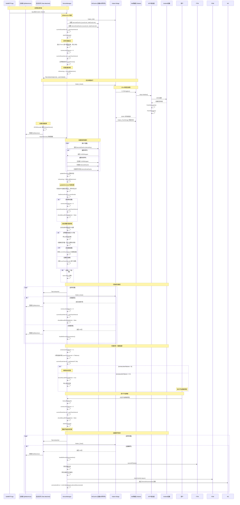

## 3. 文件浏览时序图

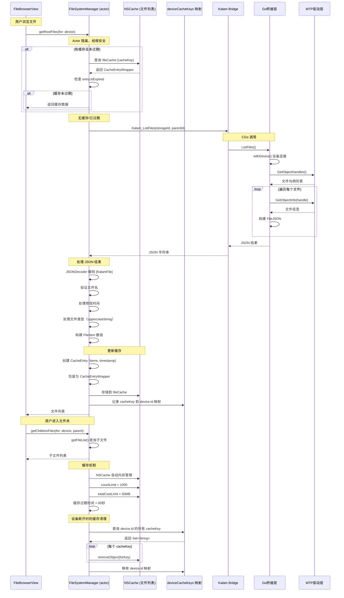

## 4. 文件下载时序图

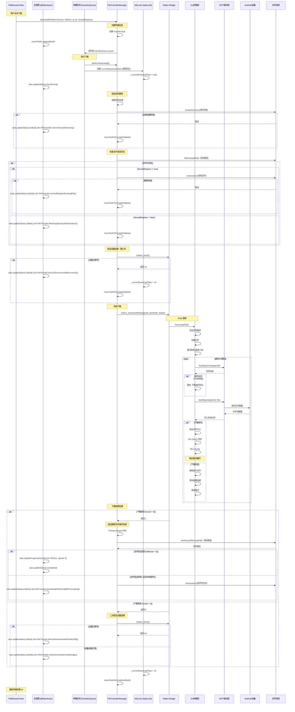

## 5. 文件上传时序图

```mermaid
sequenceDiagram
    participant View as FileBrowserView
    participant MainThread as 主线程 (@MainActor)
    participant TransferQueue as 传输队列 (transferQueue)
    participant FTM as FileTransferManager
    participant Bridge as Kalam Bridge
    participant Go as Go桥接层
    participant MTP as MTP驱动层
    participant Device as Android设备
    participant FS as 文件系统
    participant FSM as FileSystemManager (actor)

    Note over View: 用户选择上传文件
    View->>FTM: uploadFile(to:device, sourceURL, parentId, storageId)

    Note over FTM: 输入验证 - 第1步：路径验证
    FTM->>FTM: 检查路径是否为空
    alt 路径为空
        Note over FTM: 返回错误（日志记录）
    end

    Note over FTM: 输入验证 - 第2步：文件存在性
    FTM->>FS: fileExists(atPath: sourceURL)
    alt 文件不存在
        FS-->>FTM: false
        Note over FTM: 返回错误（日志记录）
    end

    Note over FTM: 输入验证 - 第3步：目录检查
    FTM->>FS: fileExists(atPath: sourceURL, isDirectory)
    alt 是目录
        FS-->>FTM: true
        Note over FTM: 返回错误（不支持目录上传）
    end

    Note over FTM: 输入验证 - 第4步：文件大小
    FTM->>FS: attributesOfItem(atPath: sourceURL)
    FS-->>FTM: 文件属性
    alt 获取文件大小失败
        Note over FTM: 返回错误（日志记录）
    else 文件大小 > 10GB
        Note over FTM: 返回错误（文件过大）
    end

    Note over FTM: 输入验证 - 第5步：路径安全验证
    FTM->>FTM: validatePathSecurity(sourceURL)
    Note over FTM: 包含以下检查：
    Note over FTM: - 路径长度限制（最大4096字符）
    Note over FTM: - 路径遍历攻击检查（禁止 ".." 及其编码形式）
    Note over FTM: - 特殊字符检查（禁止控制字符）
    Note over FTM: - 符号链接检查（禁止符号链接）
    Note over FTM: - 允许目录范围验证（仅允许 Downloads、Desktop、Documents）
    Note over FTM: - 路径标准化验证（确保无相对引用）
    alt 验证失败
        Note over FTM: 返回错误（日志记录详细步骤）
    end

    Note over FTM: 输入验证 - 第6步：存储空间检查
    FTM->>FTM: 查找设备存储 (storageId)
    alt 存储未找到
        Note over FTM: 返回错误（存储不存在）
    end
    alt 文件大小 > 存储可用空间
        Note over FTM: 返回错误（设备存储空间不足）
    end

    Note over FTM: 创建任务并执行
    FTM->>FTM: 创建 TransferTask
    MainThread->>MainThread: activeTasks.append(task)
    FTM->>TransferQueue: 提交到 transferQueue.async

    TransferQueue->>FTM: performUpload()
    MainThread->>MainThread: task.updateStatus(.transferring)

    Note over FTM: 验证文件属性
    FTM->>FS: attributesOfItem(atPath: sourceURL)
    FS-->>FTM: 文件属性
    alt 获取文件属性失败
        MainThread->>MainThread: task.updateStatus(.failed(L10n.FileTransfer.cannotReadFileInfo))
        FTM->>FTM: moveTaskToCompleted(task)
    end

    Note over FTM: 检查任务取消状态
    alt task.isCancelled
        MainThread->>MainThread: task.updateStatus(.cancelled)
        FTM->>FTM: moveTaskToCompleted(task)
    end

    Note over FTM: Swift 6 内存管理
    FTM->>FTM: 使用 utf8CString 获取 C 字符串数组
    FTM->>FTM: 手动分配内存（UnsafeMutablePointer）
    FTM->>FTM: 复制字符串内容到 C 指针
    Note over FTM: 避免嵌套 withCString 防止并发问题

    Note over FTM: 开始上传
    FTM->>Bridge: Kalam_UploadFile(storageId, parentId, sourcePath, taskId)

    Note over Bridge,Go: CGo 调用
    Bridge->>Go: UploadFile()

    Go->>Go: 验证源文件存在
    Go->>Go: withDevice() 连接设备

    Note over Go: Step 1 - 发送对象信息
    Go->>MTP: SendObjectInfo(storageId, parentId, &objInfo)
    MTP->>Device: 发送文件元数据
    Device-->>MTP: 确认接收
    MTP-->>Go: 返回新对象句柄

    Note over Go: Step 2 - 发送文件数据
    Go->>MTP: SendObject(objectHandle, file)
    MTP->>Device: 传输文件数据流
    Device-->>MTP: 确认完成
    MTP-->>Go: 传输结果

    alt 用户取消任务
        View->>FTM: cancelTask(task)
        FTM->>Bridge: Kalam_CancelTask(taskId)
        Bridge->>Go: 设置取消标记
        Go->>Go: isTaskCancelled() 检查
        Note over Go: 停止传输
    end

    Note over FTM: Swift 6 内存清理
    FTM->>FTM: defer 块执行
    FTM->>FTM: mutableSource.deallocate()
    FTM->>FTM: mutableTask.deallocate()

    Note over FTM: 上传完成处理
    Bridge-->>FTM: 返回结果

    alt 上传成功 (result > 0)
        MainThread->>MainThread: task.updateProgress(transferred: fileSize, speed: 0)
        MainThread->>MainThread: task.updateStatus(.completed)

        Note over FTM: 刷新设备存储
        FTM->>Bridge: Kalam_RefreshStorage(storageId)
        Bridge-->>FTM: 刷新结果

        Note over FTM: 重置设备缓存
        FTM->>Bridge: Kalam_ResetDeviceCache()
        Bridge-->>FTM: 重置结果

        Note over FSM: 清除文件系统缓存
        FTM->>FSM: clearCache(for: device)
        FTM->>FSM: forceClearCache()

        Note over FTM: 发送刷新通知
        MainThread->>MainThread: 延迟1秒发送 RefreshFileList 通知
        Note over View: 刷新文件列表
    else 上传失败 (result = 0)
        MainThread->>MainThread: task.updateStatus(.failed(L10n.FileTransfer.uploadFailed))
        Note over FTM: 检查设备连接状态
        FTM->>Bridge: Kalam_Scan()
    end

    FTM->>FTM: moveTaskToCompleted(task)
    Note over View: 更新传输列表 UI
```

## 6. 核心组件交互关系图

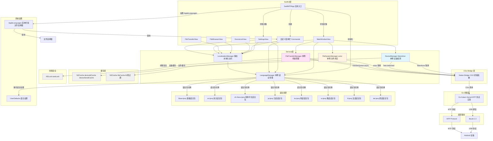

## 7. 线程模型时序图

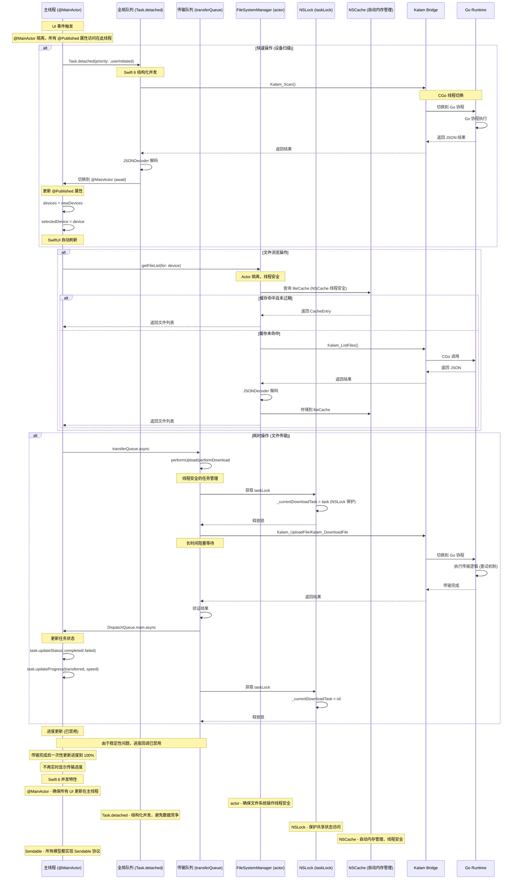

## 线程模型详细说明

### 队列职责

| 队列 | 类型 | 用途 | QoS | 典型操作 |
|------|------|------|-----|----------|
| 主线程 (@MainActor) | 串行 | UI 更新、用户交互 | - | 更新 @Published 属性、SwiftUI 刷新 |
| 全局队列 (Task.detached) | 并发 | 后台快速操作 | .userInitiated | 设备扫描、文件列表获取 |
| 传输队列 (transferQueue) | 串行 | 文件传输操作 | .userInitiated | 文件下载、文件上传 |
| Actor (FileSystemManager) | 串行 | 文件系统操作 | - | 文件列表获取、缓存管理 |

### 线程切换流程

1. **主线程 → 全局队列/传输队列**
   - 用户操作触发
   - `Task.detached(priority: .userInitiated)` (Swift 6 结构化并发)
   - `transferQueue.async`

2. **后台队列 → CGo Bridge**
   - 调用 C 函数（阻塞）
   - CGo 自动切换到 Go runtime 线程

3. **Go Runtime → CGo Bridge**
   - Go 协程执行完成
   - 返回结果到 Swift

4. **CGo Bridge → 后台队列**
   - 接收返回结果
   - 处理数据（JSON 解码等）

5. **后台队列 → 主线程**
   - `await MainActor.run` (Swift 6)
   - 更新 UI 状态

6. **主线程 → Actor**
   - `await FileSystemManager.shared.getFileList()`
   - Actor 隔离确保线程安全

### Swift 6 并发特性

1. **@MainActor 隔离**
   - `DeviceManager` 使用 `@MainActor` 标记
   - 确保所有属性访问和方法调用在主线程执行
   - 编译器强制检查，防止数据竞争

2. **Actor 隔离**
   - `FileSystemManager` 使用 `actor` 标记
   - 确保所有方法调用串行化执行
   - 编译器强制检查，防止并发访问

3. **Sendable 协议**
   - 所有模型实现 `Sendable` 协议
   - 支持跨线程传递
   - 编译器验证线程安全性

4. **Task.detached**
   - 使用结构化并发进行后台操作
   - 避免数据竞争
   - 支持优先级设置

5. **NSLock 线程安全**
   - `FileTransferManager` 使用 `NSLock` 保护 `currentDownloadTask`
   - 手动管理锁，确保线程安全

6. **NSCache 自动内存管理**
   - `DeviceManager` 和 `FileSystemManager` 使用 `NSCache`
   - 自动内存管理，线程安全
   - 支持内存压力响应

### 进度回调机制

**当前状态**: 已禁用

**禁用原因**:
- 稳定性问题：进度回调可能导致传输过程中断或崩溃
- 性能影响：频繁的跨线程调用增加开销
- 用户体验：进度更新不准确，不如等待完成后一次性更新

**替代方案**:
- 传输完成后一次性更新进度到 100%
- 显示传输状态（transferring、completed、failed）
- 提供文件大小和传输时间信息

**未来改进方向**:
- 实现更稳定的进度回调机制
- 使用批处理减少回调频率
- 添加传输速度估算

### 线程安全机制

1. **@MainActor**
   - `DeviceManager` 所有属性和方法都在主线程
   - 编译器强制检查

2. **Actor**
   - `FileSystemManager` 所有方法串行化执行
   - 编译器强制检查

3. **NSLock**
   - `FileTransferManager` 使用 `NSLock` 保护 `currentDownloadTask`
   - 手动管理锁

4. **NSCache**
   - `DeviceManager` 和 `FileSystemManager` 使用 `NSCache`
   - 自动线程安全

5. **Sendable**
   - 所有模型实现 `Sendable` 协议
   - 支持跨线程传递

6. **原子操作**
   - `isCancelled` 标志
   - 任务状态更新

### 性能优化

1. **缓存策略**
   - 文件列表缓存 60 秒
   - 设备 ID 和序列号缓存（NSCache 自动内存管理）
   - 减少重复的设备查询

2. **自适应扫描**
   - 无设备时使用指数退避
   - 有设备时使用用户设置的扫描间隔（默认3秒）
   - 用户可在设置中调整扫描间隔（1-10秒）

3. **队列优先级**
   - 使用 `.userInitiated` QoS
   - 平衡响应速度和系统资源

4. **批量操作**
   - 文件列表一次性获取
   - 减少设备通信次数

5. **结构化并发**
   - 使用 `Task.detached` 进行后台操作
   - 避免数据竞争
   - 更好的性能和可维护性

## 关键交互总结

| 场景 | 发起方 | 桥接层 | Go层 | 线程处理 | 特殊处理 |
|------|--------|--------|------|----------|----------|
| 设备扫描 | DeviceManager (@MainActor) | Kalam_Scan | withDeviceQuick | Task.detached → @MainActor | 指数退避策略、手动刷新、用户可配置扫描间隔、NSCache 缓存 |
| 文件浏览 | FileSystemManager (actor) | Kalam_ListFiles | withDevice | Actor 隔离 | NSCache 自动内存管理、60秒过期、设备级缓存清理 |
| 文件下载 | FileTransferManager | Kalam_DownloadFile | withDevice + 重试 | transferQueue → @MainActor | 设备连接验证（下载前和失败后）、NSLock 保护、文件验证 |
| 文件上传 | FileTransferManager | Kalam_UploadFile | withDevice | transferQueue → @MainActor | 7步输入验证、Swift 6 内存管理、上传后刷新 |
| 设备断开 | DeviceManager (@MainActor) | Kalam_Scan 返回空 | - | @MainActor 处理通知 | 取消所有任务、清除设备序列号缓存、清除文件系统缓存 |
| 手动刷新 | 用户 | - | - | @MainActor | 重置失败计数、重启扫描 |
| 语言切换 (菜单栏) | SwiftMTPApp | - | - | @MainActor + 通知机制 | 多语言支持（7种语言）、系统默认模式 |
| 语言切换 (设置) | SettingsView | - | - | @MainActor + 通知机制 | 语言包验证、回退机制 |
| 应用重启 | SettingsView | - | - | Process + NSApp.terminate | AppleLanguages 设置 |
| 本地化访问 | 各视图 | - | - | 计算属性实时获取 | L10n 本地化字符串 |

## 新增功能说明

### 1. Swift 6 并发特性
- **@MainActor 隔离**: `DeviceManager` 使用 `@MainActor` 确保所有 UI 相关操作在主线程执行
- **Actor 隔离**: `FileSystemManager` 使用 `actor` 确保文件系统操作线程安全
- **Sendable 协议**: 所有模型（`Device`、`FileItem`、`StorageInfo`、`MTPSupportInfo`、`TransferTask`）都实现 `Sendable` 协议，支持跨线程传递
- **Task.detached**: 使用结构化并发（`Task.detached`）进行后台操作，避免数据竞争
- **NSLock 线程安全**: `FileTransferManager` 使用 `NSLock` 保护 `currentDownloadTask` 访问

### 2. NSCache 缓存机制
- **设备缓存**:
  - `deviceIdCache`: 缓存设备 ID 到 UUID 的映射（NSCache 自动内存管理）
  - `deviceSerialCache`: 缓存设备序列号，用于设备断开检测
  - 使用序列号而不是 UUID 来检测设备断开，更可靠
- **文件缓存**:
  - `fileCache`: 缓存文件列表（60秒过期）
  - `deviceCacheKeys`: 映射设备 ID 到缓存键，支持精确清理
  - 自动内存管理：`countLimit = 1000`，`totalCostLimit = 50MB`

### 3. 指数退避策略（设备扫描）
- **目的**: 减少无设备时的扫描频率，节省系统资源
- **机制**:
  - 初始间隔: 用户设置的值（默认3秒）
  - 每次失败后: `interval = min(userScanInterval × 2^failures, 30秒)`
  - 最大失败次数: 3次
  - 达到最大失败次数后: 停止自动扫描，显示手动刷新按钮
- **用户配置**: 可在设置中调整扫描间隔（1-10秒）

### 4. 手动刷新功能
- **触发条件**: 连续扫描失败3次后
- **用户操作**: 点击手动刷新按钮
- **系统行为**:
  - 重置失败计数为0
  - 重置扫描间隔为用户设置的值（默认3秒）
  - 重新开始自动扫描

### 5. 文件上传输入验证（7步）
1. **路径验证**: 检查路径是否为空
2. **文件存在性**: 验证文件是否存在
3. **目录检查**: 确保不是目录
4. **文件大小**: 获取并验证文件大小（最大10GB）
5. **路径安全验证**: 包含以下检查
   - 路径长度限制（最大4096字符）
   - 路径遍历攻击检查（禁止 ".." 及其编码形式）
   - 特殊字符检查（禁止控制字符）
   - 符号链接检查（禁止符号链接）
   - 允许目录范围验证（仅允许 Downloads、Desktop、Documents）
   - 路径标准化验证（确保无相对引用）
6. **存储空间检查**: 验证设备存储存在且有足够空间

### 6. 文件下载增强
- **设备连接验证**: 下载前和失败后验证设备连接
- **目标目录创建**: 自动创建目标目录
- **文件存在检查**: 检查目标文件是否已存在
- **文件替换选项**: 支持替换现有文件
- **文件验证**: 验证下载文件的大小和完整性
- **损坏文件清理**: 自动删除损坏的文件
- **进度回调**: 已禁用以确保传输稳定性

### 7. 上传后刷新机制
- **刷新设备存储**: `Kalam_RefreshStorage(storageId)`
- **重置设备缓存**: `Kalam_ResetDeviceCache()`
- **清除文件系统缓存**: `FileSystemManager.clearCache(for: device)`
- **发送刷新通知**: 延迟1秒发送 `RefreshFileList` 通知

### 8. 设备断开处理增强
- **取消所有任务**: `FileTransferManager.cancelAllTasks()`
- **清除设备列表**: 清空 `devices` 和 `selectedDevice`
- **清除设备序列号缓存**: 清空 `deviceSerialCache`
- **清除文件系统缓存**: `FileSystemManager.clearCache()`
- **发送通知**: `DeviceDisconnected` 通知
- **更新错误状态**: `connectionError = L10n.MainWindow.deviceDisconnected`

### 9. 多语言支持增强
- **支持语言**: 英文、简体中文、日语、韩语、俄语、法语、德语
- **系统默认模式**: 显式检测系统语言并加载对应语言包
- **语言包验证**: 启动时验证语言包完整性
- **回退机制**: 语言包加载失败时回退到主包
- **AppleLanguages 设置**: 确保文件选择器使用正确的语言

## 语言切换机制说明

### 组件职责

- **SwiftMTPApp**: 应用启动时设置 AppleLanguages，创建自定义菜单栏
- **LanguageManager**: 管理语言状态，保存用户偏好，切换语言包
- **LocalizationManager (L10n)**: 提供类型安全的本地化字符串访问
- **各视图**: 监听语言改变通知，触发视图刷新
- **菜单栏**: 通过 SwiftUI commands 自定义，使用 L10n 本地化

### 刷新机制

各视图通过以下方式响应语言切换：
1. 添加 `@State private var refreshID = UUID()`
2. 监听 `.languageDidChange` 通知
3. 通知触发时更新 `refreshID = UUID()`
4. 使用 `.id(refreshID)` 修饰符强制视图重建
5. 计算属性 `L10n.*` 自动获取新语言的文本

### 语言包优先级

1. **系统默认**: 使用 `Bundle.main`，跟随 macOS 系统语言
2. **English**: 使用 `en.lproj` 语言包
3. **中文**: 使用 `zh-Hans.lproj` 语言包

语言设置保存在 `UserDefaults`，应用重启后自动恢复。

### 语言切换生效范围

| 组件 | 生效方式 | 是否需要重启 |
|------|----------|--------------|
| 应用内界面 (所有视图) | NotificationCenter + refreshID | ❌ 否 |
| 自定义菜单栏 | L10n 本地化字符串 | ❌ 否 |
| macOS 系统菜单栏 | AppleLanguages | ✅ 是 |
| 文件选择器 (NSOpenPanel/NSSavePanel) | AppleLanguages | ✅ 是 |

### 重启机制

当用户切换语言时：
1. 应用内界面立即更新语言
2. 系统显示重启提示对话框
3. 用户可选择"立即重启"或"稍后"
4. 重启后，AppleLanguages 生效，菜单栏和文件选择器使用新语言
5. 重启通过 `/usr/bin/open` 命令实现，确保应用正常启动
