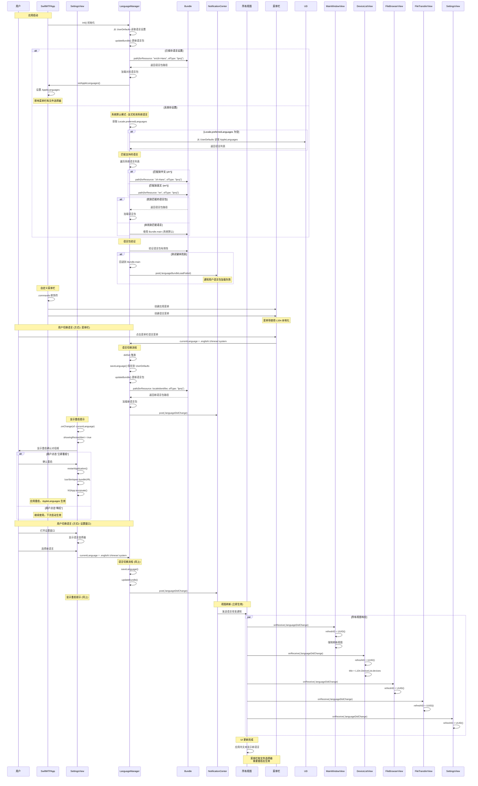
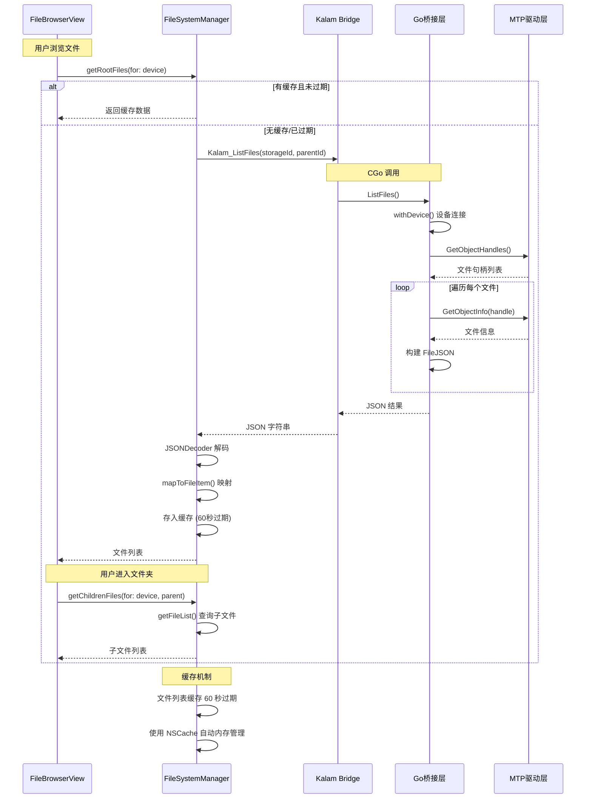
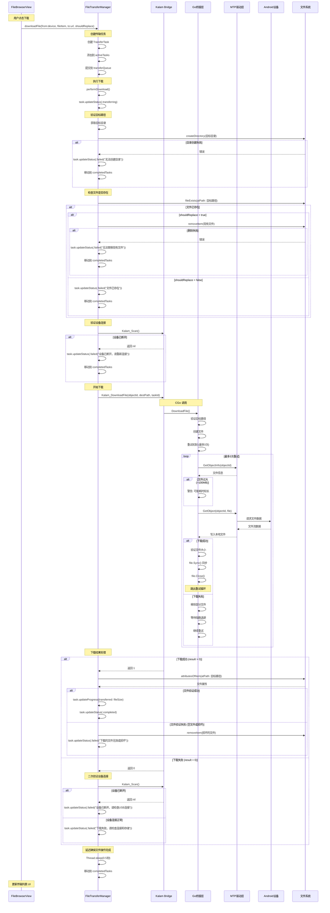
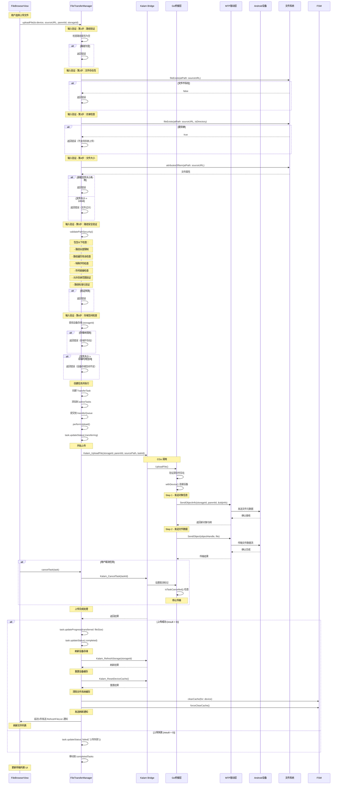
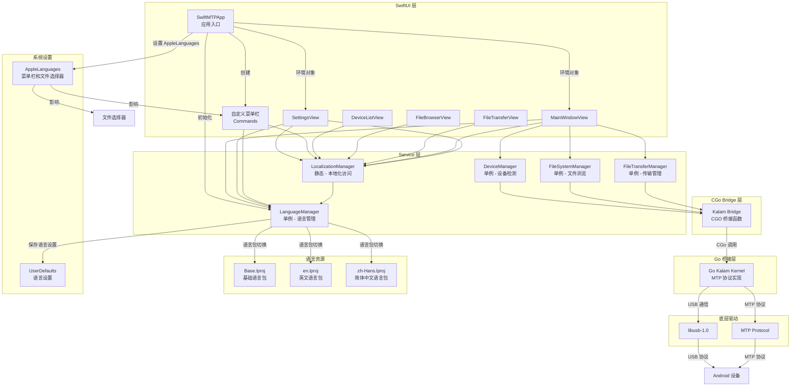
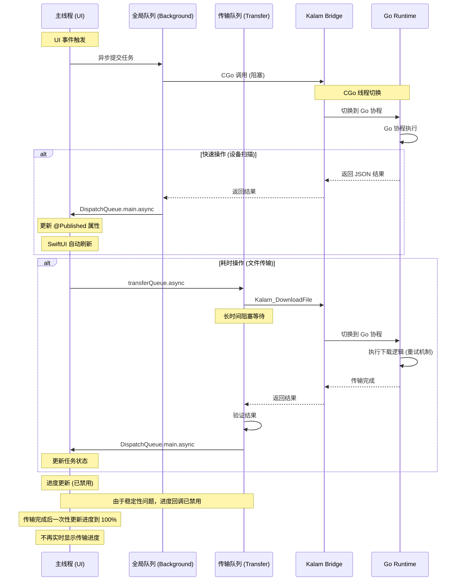

# SwiftMTP 时序图

## 1. 语言切换时序图

## 2. 设备检测时序图

```mermaid
sequenceDiagram
    participant App as SwiftMTP App
    participant DM as DeviceManager
    participant Bridge as Kalam Bridge
    participant Go as Go桥接层 (Kalam)
    participant MTP as MTP驱动层
    participant Device as Android设备
    participant User as 用户

    Note over App,DM: 应用启动阶段
    App->>DM: App 启动 (static shared)
    DM->>Bridge: Kalam_Init()

    Note over DM: 定时扫描启动
    DM->>DM: startScanning()
    DM->>DM: 启动 Timer (3秒间隔)
    DM->>DM: consecutiveFailures = 0
    DM->>DM: currentScanInterval = 3.0s
    DM->>DM: 立即触发首次 scanDevices()

    Note over DM: 扫描设备流程
    DM->>DM: isScanning = true (主线程)
    DM->>Bridge: Kalam_Scan() (全局队列)

    Note over Bridge,Go: CGo 跨语言调用
    Bridge->>Go: C.CString(json)
    Go->>MTP: mtpx.Initialize()
    MTP->>Device: USB 连接
    Device-->>MTP: 设备信息响应

    MTP->>MTP: FetchDeviceInfo()
    MTP->>MTP: FetchStorages()

    Go-->>Bridge: JSON 字符串指针
    Bridge->>Go: Kalam_FreeString() 释放内存

    Note over DM: 处理扫描结果
    DM->>DM: JSONDecoder 解码
    DM->>DM: mapToDevice() 映射数据
    DM->>DM: updateDevices() 更新状态
    DM->>DM: isScanning = false (主线程)

    Note over DM: updateDevices() 内部处理
    DM->>DM: 检查选中设备是否断开（序列号比对）
    DM->>DM: 更新设备列表和序列号缓存
    alt 检测到设备
        DM->>DM: consecutiveFailures = 0
        DM->>DM: currentScanInterval = 3.0s
        DM->>DM: showManualRefreshButton = false
    end

    Note over DM: 动态调整扫描间隔
    DM->>DM: 比较当前间隔和用户设置
    alt 间隔变化超过 0.5 秒
        DM->>DM: 停止当前定时器
        DM->>DM: 创建新定时器（用户设置的间隔）
        alt 无设备连接
            DM->>DM: 间隔 currentScanInterval (指数退避)
        else 设备已连接
            DM->>DM: 间隔 userScanInterval (用户设置)
        end
    end

    alt 仅有一个设备
        DM->>DM: auto-select 设备
    end

    Note over DM,Device: 扫描成功路径
    loop 定时扫描
        DM->>Bridge: Kalam_Scan()
        alt 扫描成功
            Bridge-->>DM: 返回设备列表
            DM->>DM: consecutiveFailures = 0
            DM->>DM: currentScanInterval = 3.0s
            DM->>DM: showManualRefreshButton = false
        else 扫描失败
            Bridge-->>DM: 返回 nil/空
            DM->>DM: handleDeviceDisconnection()
        end
    end

    Note over DM,Device: 扫描失败 - 指数退避
    DM->>DM: consecutiveFailures += 1
    DM->>DM: 计算退避间隔 (3 * 2^failures)
    DM->>DM: currentScanInterval = min(backoff, 30s)

    alt consecutiveFailures < 3
        Note over DM: 继续自动扫描
    else consecutiveFailures >= 3
        DM->>DM: showManualRefreshButton = true
        DM->>DM: 停止自动扫描
        Note over User: 显示手动刷新按钮
    end

    Note over User,DM: 用户手动刷新
    User->>DM: 点击手动刷新按钮
    DM->>DM: manualRefresh()
    DM->>DM: consecutiveFailures = 0
    DM->>DM: currentScanInterval = 3.0s
    DM->>DM: showManualRefreshButton = false
    DM->>DM: startScanning()
    Note over DM: 重新开始自动扫描

    Note over DM,Device: 设备断开检测
    loop 定时扫描
        DM->>Bridge: Kalam_Scan()
        alt 设备断开
            Bridge-->>DM: 返回 nil/空
            DM->>DM: handleDeviceDisconnection()
            DM->>DM: 取消所有传输任务
            DM->>DM: 清空设备列表
            DM->>DM: 清除文件系统缓存
            DM->>DM: 发送 DeviceDisconnected 通知
            DM->>DM: connectionError = "设备已断开"
        end
    end
```

## 3. 文件浏览时序图

## 4. 文件下载时序图

## 5. 文件上传时序图

## 6. 核心组件交互关系图

## 7. 线程模型时序图

## 线程模型详细说明

### 队列职责

| 队列 | 类型 | 用途 | QoS | 典型操作 |
|------|------|------|-----|----------|
| 主线程 (Main Thread) | 串行 | UI 更新、用户交互 | - | 更新 @Published 属性、SwiftUI 刷新 |
| 全局队列 (Global Queue) | 并发 | 后台快速操作 | .userInitiated | 设备扫描、文件列表获取 |
| 传输队列 (Transfer Queue) | 串行 | 文件传输操作 | .userInitiated | 文件下载、文件上传 |

### 线程切换流程

1. **主线程 → 全局队列/传输队列**
   - 用户操作触发
   - `DispatchQueue.global(qos: .userInitiated).async`
   - `transferQueue.async`

2. **后台队列 → CGo Bridge**
   - 调用 C 函数（阻塞）
   - CGo 自动切换到 Go runtime 线程

3. **Go Runtime → CGo Bridge**
   - Go 协程执行完成
   - 返回结果到 Swift

4. **CGo Bridge → 后台队列**
   - 接收返回结果
   - 处理数据（JSON 解码等）

5. **后台队列 → 主线程**
   - `DispatchQueue.main.async`
   - 更新 UI 状态

### 进度回调机制

**当前状态**: 已禁用

**禁用原因**:
- 稳定性问题：进度回调可能导致传输过程中断或崩溃
- 性能影响：频繁的跨线程调用增加开销
- 用户体验：进度更新不准确，不如等待完成后一次性更新

**替代方案**:
- 传输完成后一次性更新进度到 100%
- 显示传输状态（transferring、completed、failed）
- 提供文件大小和传输时间信息

**未来改进方向**:
- 实现更稳定的进度回调机制
- 使用批处理减少回调频率
- 添加传输速度估算

### 线程安全机制

1. **@Published 属性**
   - SwiftUI 自动处理 UI 更新
   - 必须在主线程更新

2. **缓存锁**
   - `FileSystemManager` 使用 `NSLock`
   - 保护文件缓存读写

3. **任务锁**
   - `FileTransferManager` 使用 `NSLock`
   - 保护 `currentDownloadTask` 访问

4. **原子操作**
   - `isCancelled` 标志
   - 任务状态更新

### 性能优化

1. **缓存策略**
   - 文件列表缓存 60 秒
   - 减少重复的设备查询

2. **自适应扫描**
   - 无设备时使用指数退避
   - 有设备时使用用户设置的扫描间隔（默认3秒）
   - 用户可在设置中调整扫描间隔（1-10秒）

3. **队列优先级**
   - 使用 `.userInitiated` QoS
   - 平衡响应速度和系统资源

4. **批量操作**
   - 文件列表一次性获取
   - 减少设备通信次数

## 关键交互总结

| 场景 | 发起方 | 桥接层 | Go层 | 线程处理 | 特殊处理 |
|------|--------|--------|------|----------|----------|
| 设备扫描 | DeviceManager | Kalam_Scan | withDeviceQuick | 全局队列 → 主线程 | 指数退避策略、手动刷新、用户可配置扫描间隔 |
| 文件浏览 | FileSystemManager | Kalam_ListFiles | withDevice | 全局队列 → 主线程 | 30秒缓存 |
| 文件下载 | FileTransferManager | Kalam_DownloadFile | withDevice + 重试 | 传输队列 → 主线程 | 设备连接验证、文件验证 |
| 文件上传 | FileTransferManager | Kalam_UploadFile | withDevice | 传输队列 → 主线程 | 8步输入验证、上传后刷新 |
| 设备断开 | DeviceManager | Kalam_Scan 返回空 | - | 主线程处理通知 | 取消所有任务、清除缓存 |
| 手动刷新 | 用户 | - | - | 主线程 | 重置失败计数、重启扫描 |
| 语言切换 (菜单栏) | SwiftMTPApp | - | - | 主线程 + 通知机制 | - |
| 语言切换 (设置) | SettingsView | - | - | 主线程 + 通知机制 | - |
| 应用重启 | SettingsView | - | - | Process + NSApp.terminate | - |
| 本地化访问 | 各视图 | - | - | 计算属性实时获取 | - |

## 新增功能说明

### 1. 指数退避策略（设备扫描）
- **目的**: 减少无设备时的扫描频率，节省系统资源
- **机制**:
  - 初始间隔: 用户设置的值（默认3秒）
  - 每次失败后: interval = min(userScanInterval × 2^failures, 30秒)
  - 最大失败次数: 3次
  - 达到最大失败次数后: 停止自动扫描，显示手动刷新按钮
- **用户配置**: 可在设置中调整扫描间隔（1-10秒）

### 2. 手动刷新功能
- **触发条件**: 连续扫描失败3次后
- **用户操作**: 点击手动刷新按钮
- **系统行为**:
  - 重置失败计数为0
  - 重置扫描间隔为用户设置的值（默认3秒）
  - 重新开始自动扫描

### 3. 文件上传输入验证（7步）
1. **路径验证**: 检查路径是否为空
2. **文件存在性**: 验证文件是否存在
3. **目录检查**: 确保不是目录
4. **文件大小**: 获取并验证文件大小（最大10GB）
5. **路径安全验证**: 包含以下检查
   - 路径长度限制（最大4096字符）
   - 路径遍历攻击检查（禁止 ".." 及其编码形式）
   - 特殊字符检查（禁止控制字符）
   - 符号链接检查（禁止符号链接）
   - 允许目录范围验证（仅允许 Downloads、Desktop、Documents）
   - 路径标准化验证（确保无相对引用）
6. **存储空间检查**: 验证设备存储存在且有足够空间

### 4. 文件下载增强
- **设备连接验证**: 下载前和失败后验证设备连接
- **目标目录创建**: 自动创建目标目录
- **文件存在检查**: 检查目标文件是否已存在
- **文件替换选项**: 支持替换现有文件
- **文件验证**: 验证下载文件的大小和完整性
- **损坏文件清理**: 自动删除损坏的文件
- **进度回调**: 已禁用以确保传输稳定性

### 5. 上传后刷新机制
- **刷新设备存储**: `Kalam_RefreshStorage(storageId)`
- **重置设备缓存**: `Kalam_ResetDeviceCache()`
- **清除文件系统缓存**: `FileSystemManager.clearCache(for: device)`
- **发送刷新通知**: 延迟1秒发送 `RefreshFileList` 通知

### 6. 设备断开处理增强
- **取消所有任务**: `FileTransferManager.cancelAllTasks()`
- **清除设备列表**: 清空 `devices` 和 `selectedDevice`
- **清除文件系统缓存**: `FileSystemManager.clearCache()`
- **发送通知**: `DeviceDisconnected` 通知
- **更新错误状态**: `connectionError = "设备已断开"`

## 语言切换机制说明

### 组件职责

- **SwiftMTPApp**: 应用启动时设置 AppleLanguages，创建自定义菜单栏
- **LanguageManager**: 管理语言状态，保存用户偏好，切换语言包
- **LocalizationManager (L10n)**: 提供类型安全的本地化字符串访问
- **各视图**: 监听语言改变通知，触发视图刷新
- **菜单栏**: 通过 SwiftUI commands 自定义，使用 L10n 本地化

### 刷新机制

各视图通过以下方式响应语言切换：
1. 添加 `@State private var refreshID = UUID()`
2. 监听 `.languageDidChange` 通知
3. 通知触发时更新 `refreshID = UUID()`
4. 使用 `.id(refreshID)` 修饰符强制视图重建
5. 计算属性 `L10n.*` 自动获取新语言的文本

### 语言包优先级

1. **系统默认**: 使用 `Bundle.main`，跟随 macOS 系统语言
2. **English**: 使用 `en.lproj` 语言包
3. **中文**: 使用 `zh-Hans.lproj` 语言包

语言设置保存在 `UserDefaults`，应用重启后自动恢复。

### 语言切换生效范围

| 组件 | 生效方式 | 是否需要重启 |
|------|----------|--------------|
| 应用内界面 (所有视图) | NotificationCenter + refreshID | ❌ 否 |
| 自定义菜单栏 | L10n 本地化字符串 | ❌ 否 |
| macOS 系统菜单栏 | AppleLanguages | ✅ 是 |
| 文件选择器 (NSOpenPanel/NSSavePanel) | AppleLanguages | ✅ 是 |

### 重启机制

当用户切换语言时：
1. 应用内界面立即更新语言
2. 系统显示重启提示对话框
3. 用户可选择"立即重启"或"稍后"
4. 重启后，AppleLanguages 生效，菜单栏和文件选择器使用新语言
5. 重启通过 `/usr/bin/open` 命令实现，确保应用正常启动
