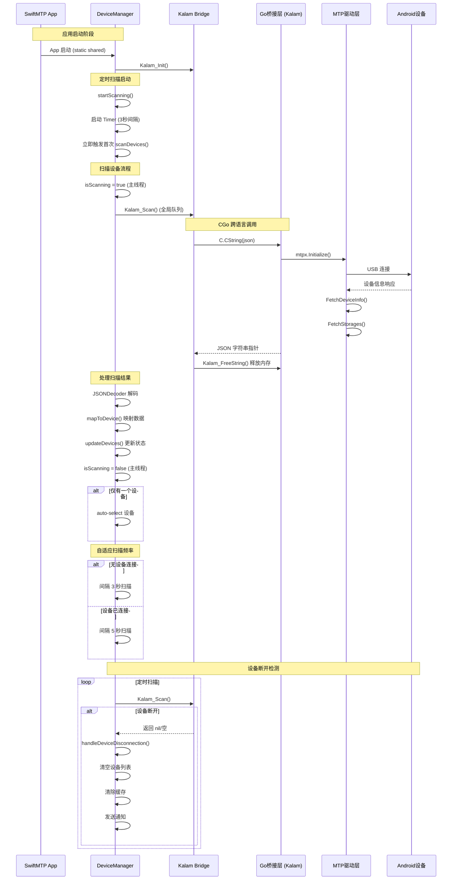
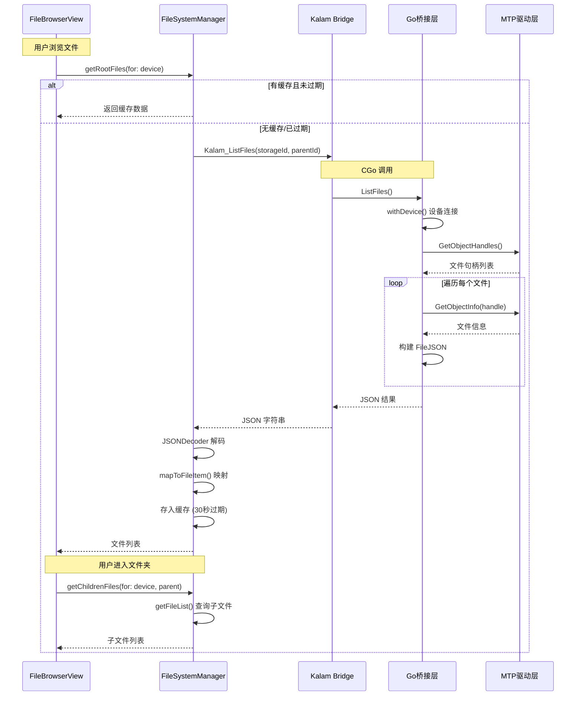
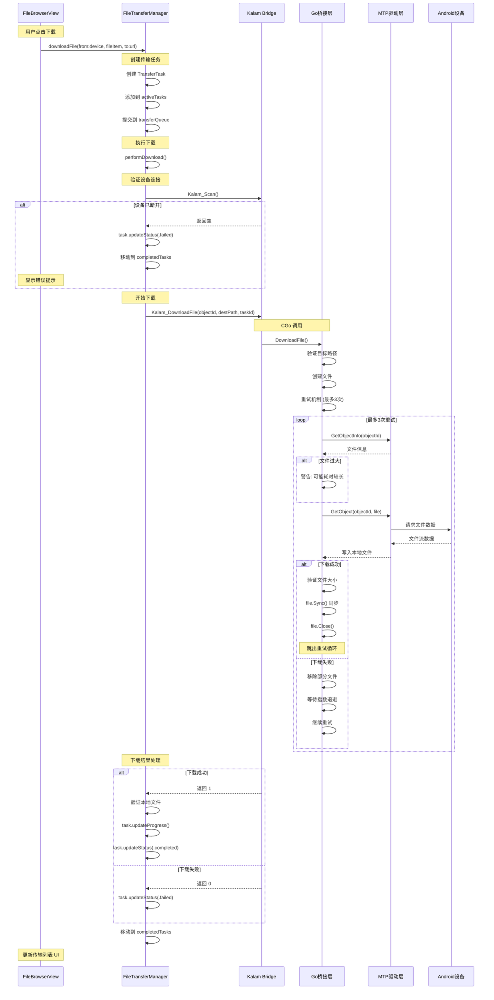
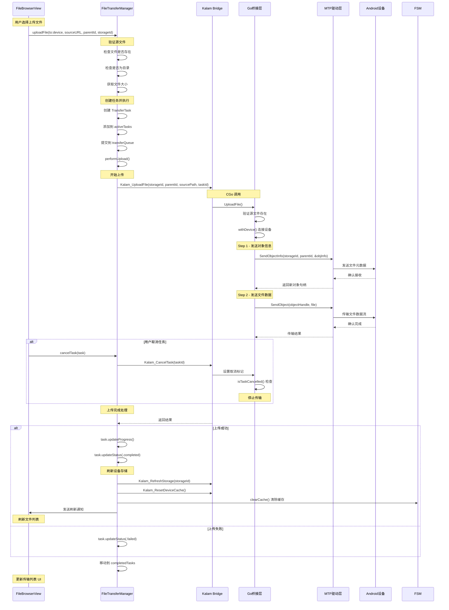
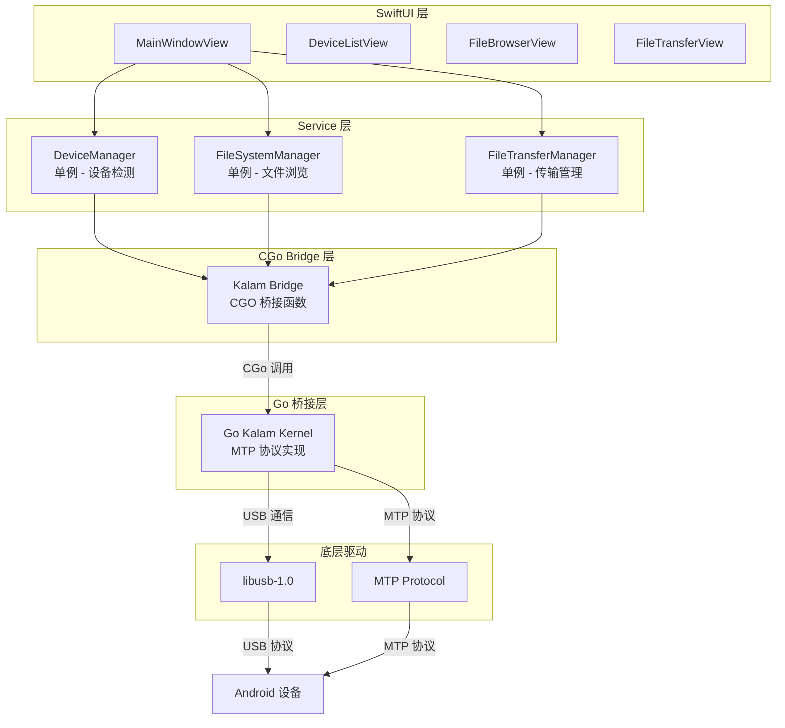
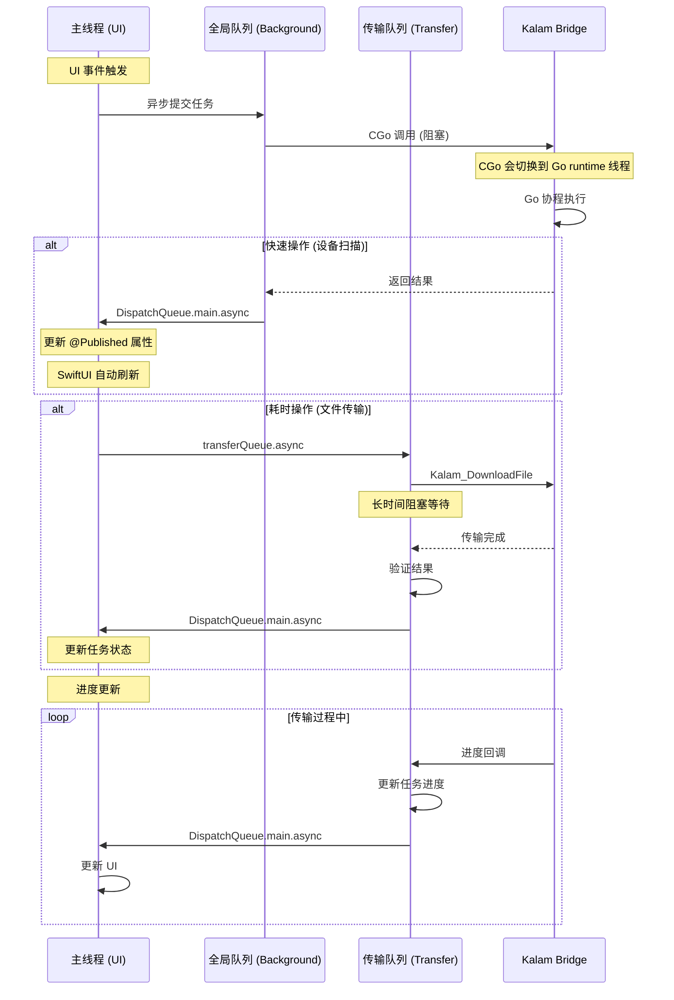

# SwiftMTP 时序图

## 1. 设备检测时序图

## 2. 文件浏览时序图

## 3. 文件下载时序图

## 4. 文件上传时序图

## 5. 核心组件交互关系图

## 6. 线程模型时序图

## 关键交互总结

| 场景 | 发起方 | 桥接层 | Go层 | 线程处理 |
|------|--------|--------|------|----------|
| 设备扫描 | DeviceManager | Kalam_Scan | withDeviceQuick | 全局队列 → 主线程 |
| 文件浏览 | FileSystemManager | Kalam_ListFiles | withDevice | 全局队列 → 主线程 |
| 文件下载 | FileTransferManager | Kalam_DownloadFile | withDevice + 重试 | 传输队列 → 主线程 |
| 文件上传 | FileTransferManager | Kalam_UploadFile | withDevice | 传输队列 → 主线程 |
| 设备断开 | DeviceManager | Kalam_Scan 返回空 | - | 主线程处理通知 |
