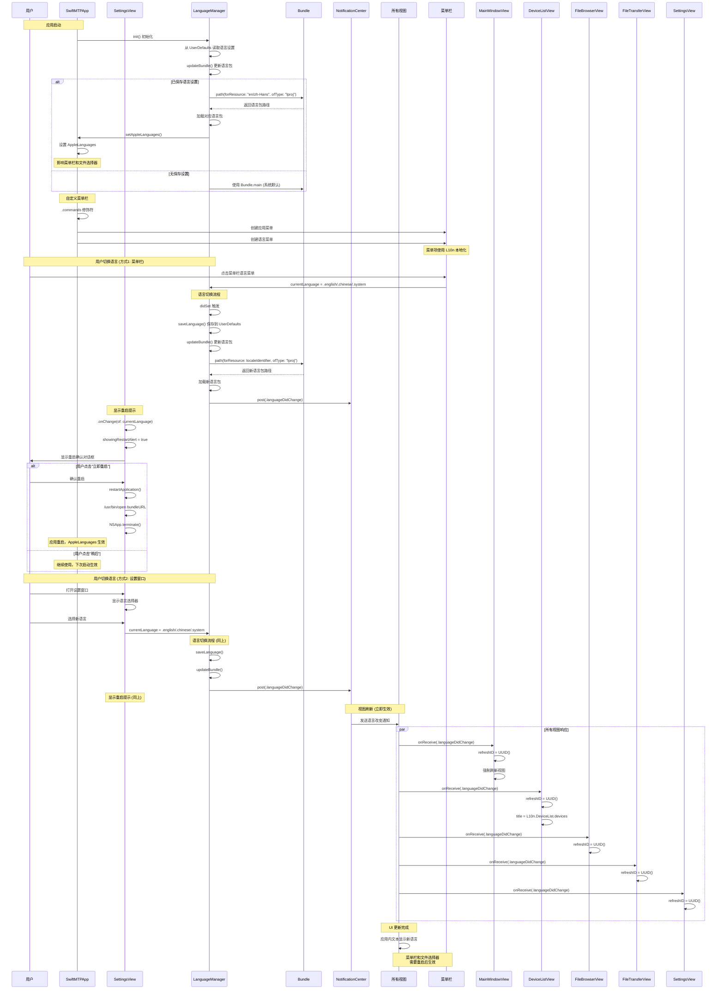
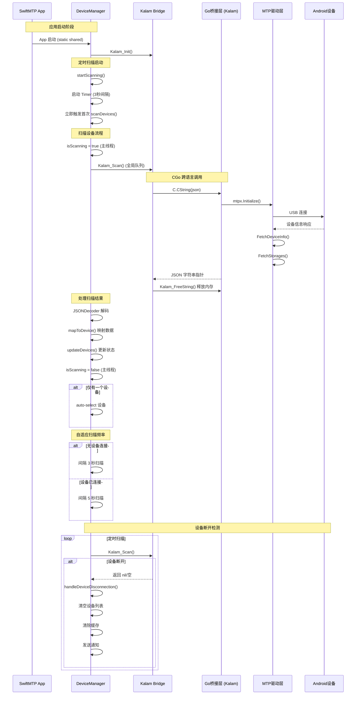
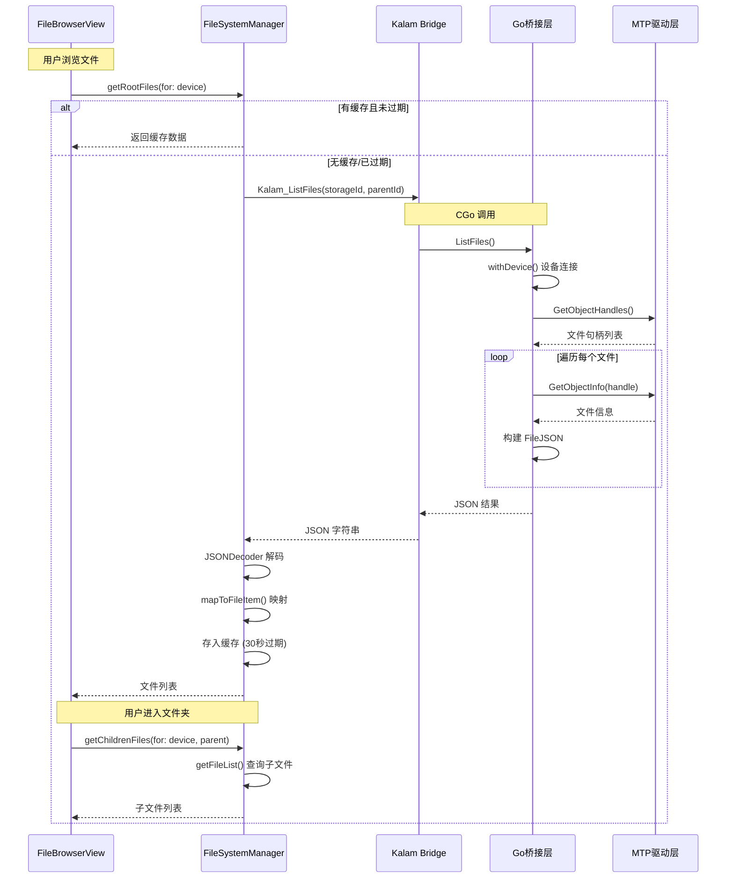
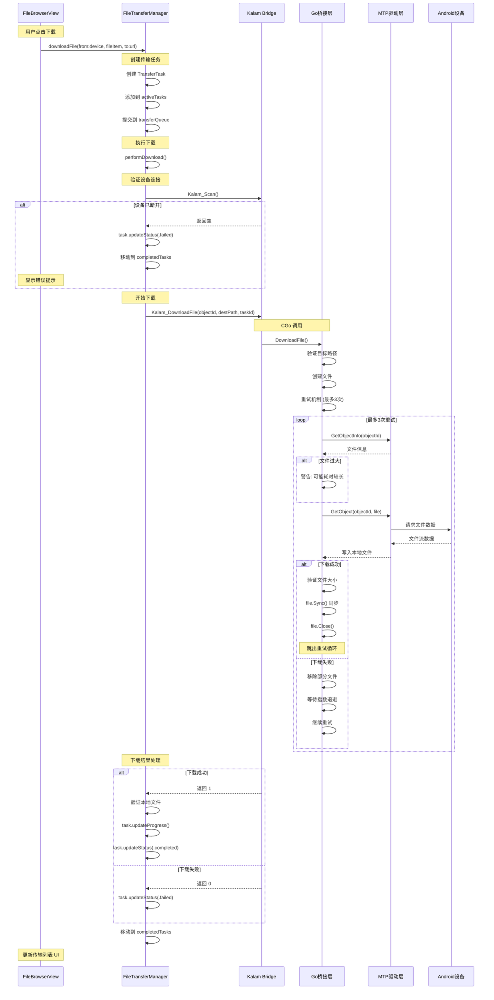
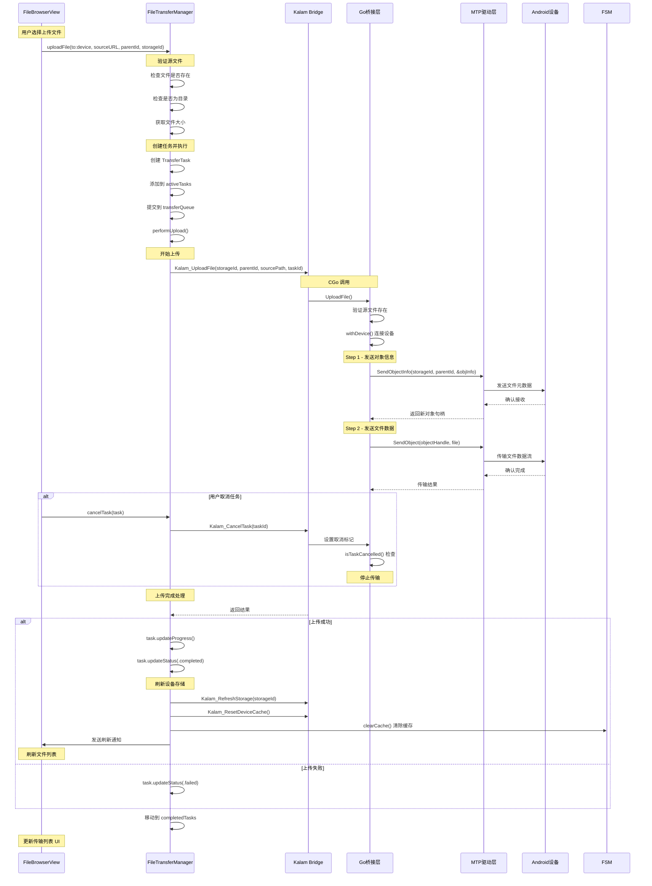
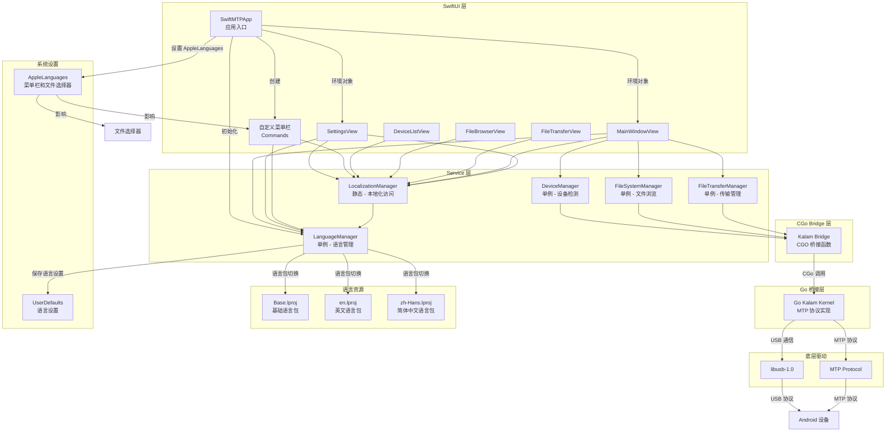
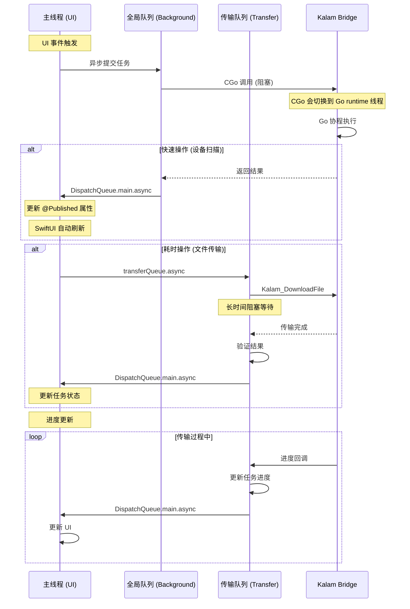

# SwiftMTP 时序图

## 1. 语言切换时序图

## 2. 设备检测时序图

## 3. 文件浏览时序图

## 4. 文件下载时序图

## 5. 文件上传时序图

## 6. 核心组件交互关系图

## 7. 线程模型时序图

## 关键交互总结

| 场景 | 发起方 | 桥接层 | Go层 | 线程处理 |
|------|--------|--------|------|----------|
| 设备扫描 | DeviceManager | Kalam_Scan | withDeviceQuick | 全局队列 → 主线程 |
| 文件浏览 | FileSystemManager | Kalam_ListFiles | withDevice | 全局队列 → 主线程 |
| 文件下载 | FileTransferManager | Kalam_DownloadFile | withDevice + 重试 | 传输队列 → 主线程 |
| 文件上传 | FileTransferManager | Kalam_UploadFile | withDevice | 传输队列 → 主线程 |
| 设备断开 | DeviceManager | Kalam_Scan 返回空 | - | 主线程处理通知 |
| 语言切换 (菜单栏) | SwiftMTPApp | - | - | 主线程 + 通知机制 |
| 语言切换 (设置) | SettingsView | - | - | 主线程 + 通知机制 |
| 应用重启 | SettingsView | - | - | Process + NSApp.terminate |
| 本地化访问 | 各视图 | - | - | 计算属性实时获取 |

## 语言切换机制说明

### 组件职责

- **SwiftMTPApp**: 应用启动时设置 AppleLanguages，创建自定义菜单栏
- **LanguageManager**: 管理语言状态，保存用户偏好，切换语言包
- **LocalizationManager (L10n)**: 提供类型安全的本地化字符串访问
- **各视图**: 监听语言改变通知，触发视图刷新
- **菜单栏**: 通过 SwiftUI commands 自定义，使用 L10n 本地化

### 刷新机制

各视图通过以下方式响应语言切换：
1. 添加 `@State private var refreshID = UUID()`
2. 监听 `.languageDidChange` 通知
3. 通知触发时更新 `refreshID = UUID()`
4. 使用 `.id(refreshID)` 修饰符强制视图重建
5. 计算属性 `L10n.*` 自动获取新语言的文本

### 语言包优先级

1. **系统默认**: 使用 `Bundle.main`，跟随 macOS 系统语言
2. **English**: 使用 `en.lproj` 语言包
3. **中文**: 使用 `zh-Hans.lproj` 语言包

语言设置保存在 `UserDefaults`，应用重启后自动恢复。

### 语言切换生效范围

| 组件 | 生效方式 | 是否需要重启 |
|------|----------|--------------|
| 应用内界面 (所有视图) | NotificationCenter + refreshID | ❌ 否 |
| 自定义菜单栏 | L10n 本地化字符串 | ❌ 否 |
| macOS 系统菜单栏 | AppleLanguages | ✅ 是 |
| 文件选择器 (NSOpenPanel/NSSavePanel) | AppleLanguages | ✅ 是 |

### 重启机制

当用户切换语言时：
1. 应用内界面立即更新语言
2. 系统显示重启提示对话框
3. 用户可选择"立即重启"或"稍后"
4. 重启后，AppleLanguages 生效，菜单栏和文件选择器使用新语言
5. 重启通过 `/usr/bin/open` 命令实现，确保应用正常启动
